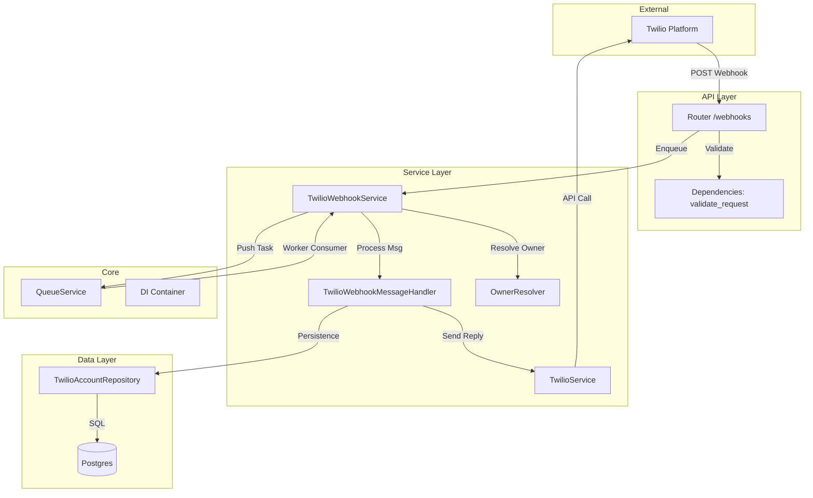

# Análise de Conformidade: Módulo Twilio (Channels)

## 1. Sumário Executivo

O módulo `src/modules/channels/twilio` apresenta uma arquitetura **robusta e madura**, seguindo rigorosamente os princípios de Clean Architecture e SOLID. O destaque positivo é a implementação do padrão **Async-First**, onde webhooks são imediatamente enfileirados (`QueueService`) para processamento em background, garantindo alta resiliência e tempos de resposta mínimos para a API do Twilio.

A segurança está bem endereçada com validação de assinaturas (`X-Twilio-Signature`) e verificação de plano de acesso. Diferente da avaliação inicial, **o módulo possui uma cobertura abrangente de Testes Unitários** (`tests/modules/channels/twilio`), que validam a lógica de serviços, handlers e repositórios com uso adequado de mocks. A principal lacuna permanece na ausência de testes de integração end-to-end (E2E) que validem o fluxo completo com banco de dados real.

**Nota Geral:** 9.0/10

---

## 2. Mapa de Responsabilidades

---

## 3. Avaliação por Categorias

### ✅ Conformidade Arquitetural
**Status:** ✅ Conforme
**Justificativa:** O módulo segue claramente a separação de responsabilidades.
- **Design:** Uso exemplar de Injeção de Dependência (`dependency_injector`).
- **Async:** Implementação correta de `run_in_threadpool` para operações bloqueantes (DB) e uso de filas para tarefas pesadas.
- **Modularização:** Divisão clara em `api`, `services`, `repositories`, `models`.

### 🔒 Segurança
**Status:** ✅ Conforme
**Justificativa:**
- **Autenticação:** Validação mandatória de `X-Twilio-Signature` em produção.
- **Autorização:** Verificação de `validate_owner_access` impede uso por contas inativas.
- **PII:** Logs utilizam `structlog` com processador de mascaramento (conforme verificado nas Core Memories).

### 🧼 Qualidade de Código
**Status:** ✅ Conforme
**Justificativa:**
- **Estilo:** Código limpo, PEP 8 respeitado, docstrings presentes.
- **Tipagem:** Uso extensivo de Type Hints.
- **Testes:** ✅ **Alta cobertura de testes unitários** em `tests/modules/channels/twilio/`. Os testes utilizam `pytest`, `unittest.mock` e `pytest-asyncio` para isolar dependências e validar cenários de sucesso, erro e borda (ex: `test_process_webhook_local_sender`, `test_determine_message_type_audio`).

### 🚀 Performance
**Status:** ✅ Conforme
**Justificativa:**
- **Webhook:** Retorno imediato (200 OK) após enfileiramento.
- **DB:** Uso de `run_in_threadpool` mitiga o fato do driver `psycopg2` ser síncrono.
- **Cache:** `TwilioService` implementa cache local de clientes para evitar recriação de objetos.

### 📚 Documentação
**Status:** ✅ Conforme
**Justificativa:**
- Docstrings explicativas em classes e métodos principais.
- DTOs bem definidos servem como documentação implícita dos payloads.

---

## 4. Pontos Fortes e Fracos

### 💪 Pontos Fortes
1.  **Async-First Architecture:** O design de enfileirar webhooks é excelente para escalabilidade.
2.  **Cobertura de Testes Unitários:** A suíte de testes é bem estruturada, mockando dependências externas (Queue, DB) para testes rápidos e confiáveis.
3.  **Modularização e DI:** Separação clara entre camadas facilitada pelo Container de Injeção de Dependência.
4.  **Resiliência:** Tratamento de Race Conditions (`handle_duplicate_message`).

### ⚠️ Pontos Fracos
1.  **Falta de Testes de Integração:** Embora os testes unitários sejam bons, faltam testes que validem a integração real com o Banco de Dados (sem mocks) e o contrato da API.
2.  **Driver Síncrono (Postgres):** O repositório usa `psycopg2` (sync). Migrar para `asyncpg` traria ganhos de performance em alta concorrência.
3.  **Dependência de Implementação Específica:** Alguns testes dependem de mocks muito específicos da implementação interna, o que pode tornar refatorações ligeiramente mais custosas.

---

## 5. Matriz de Priorização (Riscos x Esforço)

| Risco | Impacto | Esforço | Ação Recomendada |
| :--- | :---: | :---: | :--- |
| **Driver DB Síncrono** | 🟡 Médio | Alto | Migrar `PostgresTwilioAccountRepository` para `asyncpg` (longo prazo). |
| **Gap de Testes de Integração** | 🟡 Médio | Médio | Criar testes de integração usando um container DB de teste (Testcontainers ou similar). |

---

## 6. Plano de Ação

1.  **Melhoria Contínua:** Manter a excelente cobertura de testes unitários a cada nova feature.
2.  **Performance:** Planejar a migração para `asyncpg` no futuro para remover a necessidade de `run_in_threadpool` nas operações de banco.
3.  **Integração:** Adicionar 1 ou 2 testes de "caminho feliz" (Happy Path) que subam o banco de teste para garantir que as queries SQL manuais estão corretas (já que os testes unitários mockam o cursor).

## 7. Perguntas de Arquitetura

1.  *Considerando a arquitetura Async, valeria a pena mover a persistência do webhook ("received") para dentro do Worker também, deixando o endpoint HTTP apenas como um "Gateway" puro sem acesso a DB (nem para validar Owner)? Isso aumentaria ainda mais o throughput.*
2.  *Existe plano para adotar `SQLAlchemy Async` ou `Tortoise ORM` para padronizar o acesso a dados e evitar SQL manual no repositório?*

---

**Relatório Gerado em:** 2026-02-05
**Autor:** Agente de Arquitetura Trae AI
