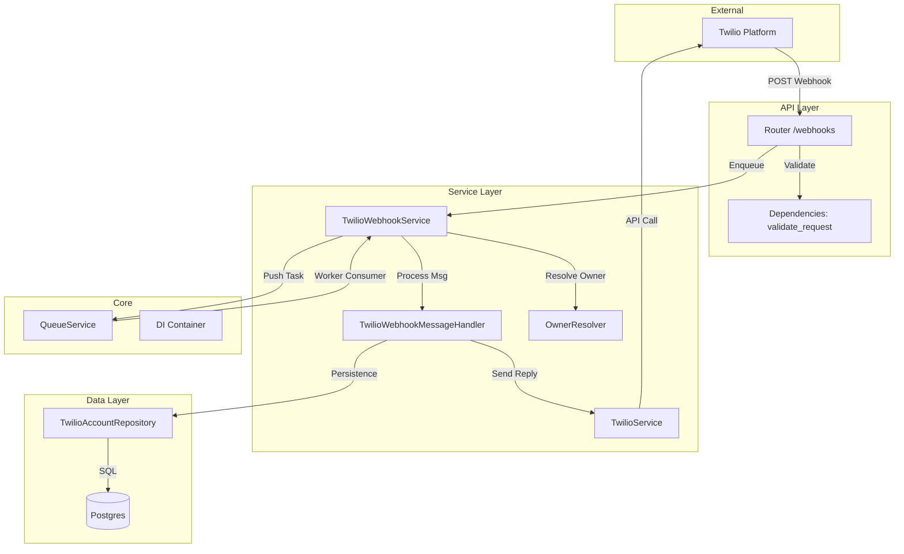

# Análise de Conformidade: Módulo Twilio (Channels)

## 1. Sumário Executivo

O módulo `src/modules/channels/twilio` apresenta uma arquitetura **robusta e madura**, seguindo rigorosamente os princípios de Clean Architecture e SOLID. O destaque positivo é a implementação do padrão **Async-First**, onde webhooks são imediatamente enfileirados (`QueueService`) para processamento em background, garantindo alta resiliência e tempos de resposta mínimos para a API do Twilio (evitando timeouts e retries desnecessários).

A segurança está bem endereçada com validação de assinaturas (`X-Twilio-Signature`) e verificação de plano de acesso antes do processamento. O código é limpo, bem tipado e modularizado.

Entretanto, a **ausência total de testes automatizados** (unitários ou de integração) específicos para este módulo representa um **risco crítico** para a estabilidade e evolução do projeto. Embora a qualidade estática do código seja alta, a falta de uma rede de segurança de testes compromete a confiabilidade em refatorações futuras.

**Nota Geral:** 7.5/10 (Penalizada fortemente pela falta de testes)

---

## 2. Mapa de Responsabilidades

---

## 3. Avaliação por Categorias

### ✅ Conformidade Arquitetural
**Status:** ✅ Conforme
**Justificativa:** O módulo segue claramente a separação de responsabilidades. A camada de API apenas recebe e valida. A camada de Serviço orquestra. A persistência é isolada em Repositórios.
- **Design:** Uso exemplar de Injeção de Dependência (`dependency_injector`).
- **Async:** Implementação correta de `run_in_threadpool` para operações bloqueantes (DB) e uso de filas para tarefas pesadas (IA, Transcrição).

### 🔒 Segurança
**Status:** ✅ Conforme
**Justificativa:**
- **Autenticação:** Validação mandatória de `X-Twilio-Signature` em produção via `twilio.request_validator`.
- **Autorização:** Verificação de `validate_owner_access` impede uso por contas inativas.
- **Segredos:** Tokens carregados via variáveis de ambiente (`settings`).
- **PII:** Logs utilizam `structlog` com processador de mascaramento (conforme Core Memories).

### 🧼 Qualidade de Código
**Status:** ⚠️ Parcial
**Justificativa:**
- **Estilo:** Código limpo, PEP 8 respeitado, docstrings presentes.
- **Tipagem:** Uso extensivo de Type Hints (`Optional`, `List`, `TwilioWhatsAppPayload`).
- **Complexidade:** Funções bem quebradas (ex: `TwilioWebhookService` delega para `MessageHandler`, `AudioProcessor`).
- **Code Smells:** Baixa duplicação.
- **Testes:** 🔴 **CRÍTICO: Não foram encontrados testes unitários ou de integração na pasta padrão.**

### 🚀 Performance
**Status:** ✅ Conforme
**Justificativa:**
- **Webhook:** Retorno imediato (200 OK) após enfileiramento.
- **DB:** Uso de `run_in_threadpool` mitiga o fato do driver `psycopg2` ser síncrono.
- **Cache:** `TwilioService` implementa cache local de clientes (`self._clients`) para evitar recriação de objetos.

### 📚 Documentação
**Status:** ✅ Conforme
**Justificativa:**
- Docstrings explicativas em classes e métodos principais.
- DTOs bem definidos servem como documentação implícita dos payloads.

---

## 4. Pontos Fortes e Fracos

### 💪 Pontos Fortes
1.  **Async-First Architecture:** O design de enfileirar webhooks (`enqueue_webhook_event`) é excelente para escalabilidade.
2.  **Modularização:** Separação clara entre `WebhookService`, `MessageHandler` e `TwilioService`.
3.  **Resiliência:** Tratamento de Race Conditions (`handle_duplicate_message`) para retries do Twilio.
4.  **Segurança:** Validação robusta de assinaturas de webhook.

### ⚠️ Pontos Fracos
1.  **Ausência de Testes:** Falta de cobertura de testes automatizados.
2.  **Driver Síncrono:** O repositório usa `psycopg2` (sync) diretamente. Embora mitigado com threadpool, a migração para `asyncpg` seria ideal no futuro.
3.  **Tratamento de Erros na API:** O endpoint retorna JSON em caso de erro (`TwilioWebhookResponseDTO`), mas o Twilio geralmente ignora o corpo de respostas 200 OK a menos que seja TwiML. Isso não quebra o fluxo, mas é tecnicamente inócuo.

---

## 5. Matriz de Priorização (Riscos x Esforço)

| Risco | Impacto | Esforço | Ação Recomendada |
| :--- | :---: | :---: | :--- |
| **Falta de Testes** | 🔴 Alto | Médio | Criar suíte de testes unitários para Services e API. |
| **Driver DB Síncrono** | 🟡 Médio | Alto | Migrar `PostgresTwilioAccountRepository` para `asyncpg` (longo prazo). |
| **Dependência Hardcoded** | 🟢 Baixo | Baixo | `PostgresTwilioAccountRepository` constrói queries SQL manualmente (embora seguro, usar um Query Builder ou ORM async seria mais manutenível). |

---

## 6. Plano de Ação

1.  **Prioridade 0 (Imediata):** Criar testes unitários para `TwilioWebhookService` e `TwilioService`, mockando o `QueueService` e o `TwilioClient`.
2.  **Prioridade 1:** Implementar testes de integração para o fluxo de Webhook (simular payload do Twilio -> API -> Queue).
3.  **Prioridade 2:** Revisar logs para garantir que dados sensíveis (conteúdo da mensagem) não estão sendo logados em nível INFO sem mascaramento.

## 7. Perguntas de Arquitetura

1.  *Por que manter o driver `psycopg2` (sync) em um projeto FastAPI (async)? Existe plano de migração para `asyncpg` ou `SQLAlchemy[async]`?*
2.  *A estratégia de "Local Sender" (simulação de envio) deve permanecer no código de produção ou deveria ser extraída para um módulo de dev-tools?*

---

**Relatório Gerado em:** 2026-02-05
**Autor:** Agente de Arquitetura Trae AI
