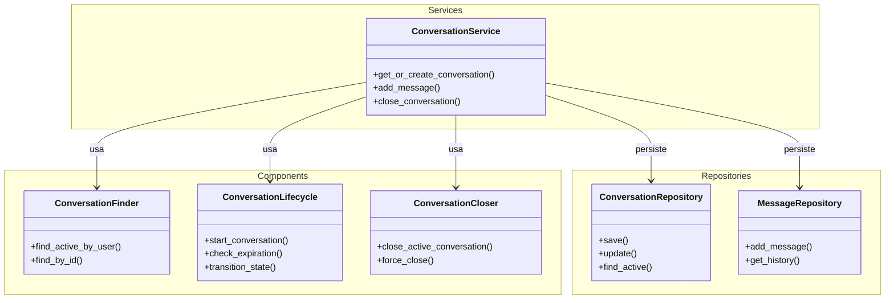
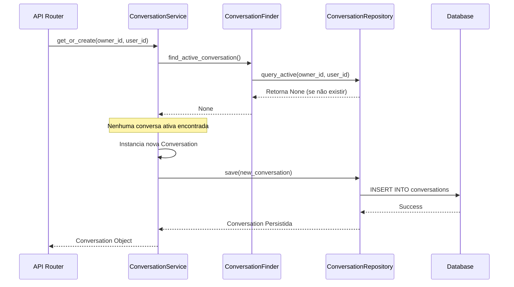
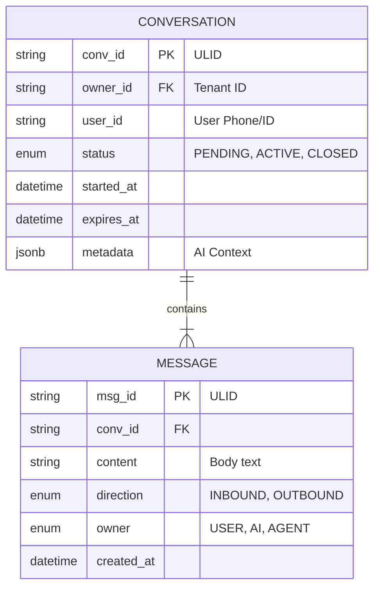

# 💬 Módulo Conversation (V2)

   

> **Núcleo de gerenciamento de sessões, ciclo de vida e persistência de interações.**

## 📖 Descrição

O módulo **Conversation** é o coração da plataforma **WhatsApp Twilio AI**, responsável por orquestrar todo o ciclo de vida das interações entre usuários e o sistema. Ele gerencia desde a criação de novas conversas, manutenção de contexto, persistência de mensagens até o encerramento e expiração de sessões (timeouts).

Projetado com **Clean Architecture**, o módulo separa claramente responsabilidades em componentes especializados (`Finder`, `Lifecycle`, `Closer`) e utiliza o padrão **Repository** para abstração de banco de dados, suportando implementações híbridas (Postgres/Supabase).

## 📸 Visão Geral da Arquitetura

### Diagrama de Componentes
A estrutura interna do `ConversationService` atua como um *Facade*, delegando lógicas específicas para componentes menores.



### Fluxo de Criação/Recuperação (Sequence)
Como o sistema decide se cria uma nova conversa ou reutiliza uma existente:



## ✨ Funcionalidades Principais

- **Ciclo de Vida Completo**: Gerenciamento de estados (`PENDING` -> `ACTIVE` -> `CLOSED`).
- **Persistência de Mensagens**: Armazenamento seguro e estruturado de todas as trocas de mensagens.
- **Human Handoff**: Suporte nativo para transbordo de atendimento para agentes humanos.
- **Context Management**: Armazenamento de metadados e contexto da IA (`metadata`, `context` JSONB).
- **Multi-Tenant**: Isolamento total de dados por `owner_id`.
- **Arquitetura Resiliente**: Separação entre regras de negócio e infraestrutura de dados.

## 🛠️ Tecnologias Utilizadas

- **Linguagem**: Python 3.12+
- **Framework Web**: FastAPI
- **Validação**: Pydantic (Strict Mode)
- **Banco de Dados**: PostgreSQL (via Supabase)
- **ORM/Query**: SQLModel / Supabase Client
- **Injeção de Dependência**: `dependency-injector`
- **Utilitários**: ULID para identificadores únicos ordenáveis.

## 🗂️ Modelo de Dados (ERD)

Estrutura relacional simplificada do módulo:



## 🚀 Como Usar

### Pré-requisitos
O módulo faz parte do monólito modular e requer o ambiente configurado (ver README principal), incluindo:
- Variáveis de ambiente (`.env`) carregadas.
- Conexão com Banco de Dados ativa.

### Exemplo de Uso (Service Layer)

```python
from src.core.di.container import Container

# O container já deve estar inicializado
service = Container.conversation_service()

# Criar ou recuperar conversa
conversation = await service.get_or_create_conversation(
    owner_id="01HR...",
    from_number="+5511999999999",
    to_number="+14155238886"
)

# Adicionar uma mensagem
await service.add_message(
    conversation_id=conversation.conv_id,
    content="Olá, gostaria de saber sobre o plano.",
    direction="inbound"
)
```

## 📂 Estrutura de Pastas

```bash
src/modules/conversation/
├── api/                  # Camada de Apresentação (Controllers/Routers)
│   └── v2/               # Versionamento de API
├── components/           # Lógica de Negócio Decomposta (Lifecycle, Finder, Closer)
├── dtos/                 # Data Transfer Objects (Pydantic Schemas)
├── enums/                # Enumerações (Status, Directions)
├── models/               # Entidades de Domínio (Database Models)
├── repositories/         # Abstração de Acesso a Dados
│   └── impl/             # Implementações Concretas (Postgres, Supabase)
└── services/             # Application Services (Fachada Principal)
```

## 🤝 Contribuição

1. Siga o padrão **Clean Architecture**.
2. Novas regras de negócio devem ir para `services/` ou `components/`.
3. Consultas SQL complexas devem ficar restritas aos `repositories/`.
4. Mantenha a cobertura de testes para novas funcionalidades.

## 📄 Licença

Proprietary - Todos os direitos reservados.

## 📞 Contato

Equipe de Engenharia de IA - [lennon@email.com]
