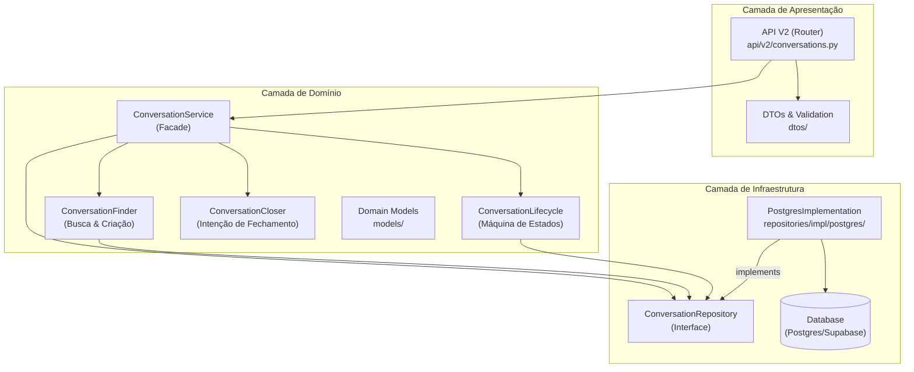

# Análise de Conformidade do Módulo `conversation`

## 1. Sumário Executivo

O módulo `conversation` apresenta um **alto nível de maturidade técnica e arquitetural**, aderindo rigorosamente aos princípios de **Clean Architecture** e **SOLID**. A separação de responsabilidades é exemplar, com uma camada de API fina, um Serviço de Domínio que atua como *Facade* e Repositórios agnósticos à infraestrutura.

A implementação de **concorrência otimista** e **processamento assíncrono** demonstra foco em escalabilidade e resiliência, essenciais para um sistema de mensageria de alto volume. A segurança é tratada como cidadã de primeira classe, com validações robustas e prevenção de injeção de SQL.

A qualidade do código é elevada, com tipagem estática consistente e cobertura de testes que valida cenários complexos (como *race conditions*). Os principais pontos de atenção referem-se à manutenção de *queries* SQL puras e à complexidade crescente da máquina de estados.

**Veredito:** O módulo está **CONFORME** (Nota: 9/10), pronto para produção e expansão.

---

## 2. Mapa de Responsabilidades

---

## 3. Avaliação por Categorias

### 3.1. Arquitetura (✅ Conforme)
*   **Status:** A estrutura segue fielmente a Arquitetura Limpa.
*   **Justificativa:** O `ConversationService` não contém lógica de banco de dados, delegando-a para repositórios. Lógicas complexas (como transição de estados e detecção de fechamento) foram extraídas para componentes dedicados (`Lifecycle`, `Closer`), evitando *God Classes*.
*   **Destaque:** O uso de Injeção de Dependência (`dependency_injector`) facilita testes e troca de implementações.

### 3.2. Segurança (✅ Conforme)
*   **Status:** Controles de segurança robustos implementados.
*   **Justificativa:**
    *   **Auth:** `Depends(get_current_owner_id)` em todos os endpoints.
    *   **Autorização:** Verificação explícita de propriedade (`if conversation.owner_id != owner_id`) previne IDOR.
    *   **SQL Injection:** Uso correto de `psycopg2.sql` para construção segura de queries dinâmicas.
    *   **Validação:** DTOs Pydantic com validadores customizados para ULIDs.

### 3.3. Qualidade de Código (✅ Conforme)
*   **Status:** Código limpo, legível e padronizado.
*   **Justificativa:**
    *   **Type Hints:** Uso extensivo em assinaturas de métodos e classes.
    *   **PEP 8:** Estilo de código consistente.
    *   **Complexidade:** Métodos mantidos curtos e focados. O método `add_message` orquestra lógica sem se tornar monolítico.

### 3.4. Performance (✅ Conforme)
*   **Status:** Otimizado para alta concorrência.
*   **Justificativa:**
    *   **Async/Await:** Stack totalmente assíncrona (FastAPI + AsyncPG).
    *   **Concorrência:** Implementação de *Optimistic Locking* (`version` column) e *Retry Pattern* para lidar com condições de corrida.
    *   **Queries:** Uso de paginação (`LIMIT/OFFSET`) e índices implícitos (`session_key`).

### 3.5. Observabilidade (✅ Conforme)
*   **Status:** Rastreabilidade garantida.
*   **Justificativa:**
    *   **Logging:** Uso de *Structured Logging* com contexto (`conv_id`, `status`).
    *   **Auditoria:** Tabela `conversation_state_history` registra todas as transições de estado da FSM.

### 3.6. Testes (✅ Conforme)
*   **Status:** Cobertura abrangente de cenários críticos.
*   **Justificativa:** Testes unitários (`test_conversation_service.py`) utilizam *mocks* adequadamente e cobrem cenários de erro e concorrência (ex: `test_assign_agent_failure`).

---

## 4. Pontos Fortes, Fracos e Riscos

### 💪 Pontos Fortes
1.  **Decomposição do Serviço:** A extração de `Finder`, `Lifecycle` e `Closer` mantém o serviço principal coeso.
2.  **Resiliência a Concorrência:** O mecanismo de *retry* com *optimistic locking* é uma solução madura para sistemas distribuídos.
3.  **Segurança por Design:** Validações de ULID e verificações de *ownership* em cada camada.

### ⚠️ Pontos Fracos
1.  **SQL Puro:** A construção de queries com strings (`sql.SQL`) no repositório, embora segura, é verbosa e mais propensa a erros de manutenção do que um *Query Builder*.
2.  **Duplicação de Constantes:** Strings mágicas para *reasons* ("user_reactivation", "agent_acceptance") poderiam ser Enum.

### 🔴 Riscos
1.  **Complexidade da FSM:** A máquina de estados (controlada pelo `Lifecycle`) tende a crescer. Sem uma visualização clara ou documentação viva, pode se tornar difícil de manter.
2.  **Acoplamento com `psycopg2`:** O repositório depende diretamente de tipos do `psycopg2`, dificultando uma eventual migração para outro driver ou ORM se necessário (baixo risco atual).

---

## 5. Matriz de Priorização

| Item | Impacto | Esforço | Prioridade |
| :--- | :---: | :---: | :---: |
| **Refatorar Strings Mágicas para Enums** | Médio | Baixo | 🟢 Quick Win |
| **Adotar Query Builder (ex: Pypika)** | Alto | Médio | 🟡 Melhoria Estrutural |
| **Documentar FSM (Diagrama de Estados)** | Alto | Baixo | 🟢 Quick Win |
| **Abstrair Driver de Banco de Dados** | Baixo | Alto | ⚪ Baixa |

---

## 6. Plano de Ação

1.  **Imediato (Quick Wins):**
    *   Criar Enum `ConversationReason` para padronizar os motivos de transição de estado.
    *   Adicionar diagrama de estados (Mermaid) no `README.md` do módulo.

2.  **Médio Prazo:**
    *   Introduzir um *Query Builder* leve (como Pypika ou SQLAlchemy Core) nos repositórios para eliminar SQL puro e aumentar a segurança de tipos nas queries.

3.  **Longo Prazo:**
    *   Avaliar extração da máquina de estados para uma biblioteca compartilhada se outros módulos precisarem de lógica similar.

---

## 7. Perguntas de Arquitetura

1.  O mecanismo de *retry* atual é suficiente para picos de tráfego, ou deveríamos considerar uma fila de mensagens (SQS/RabbitMQ) para processamento de transições de estado críticas?
2.  A tabela de histórico (`conversation_state_history`) tem política de retenção/arquivamento definida? Ela pode crescer indefinidamente.
3.  Existe necessidade de *caching* (Redis) para a busca de conversas ativas (`find_active`), dado que é uma operação muito frequente?

---

### 📊 Nota Geral: 9.0/10 (Conforme)
