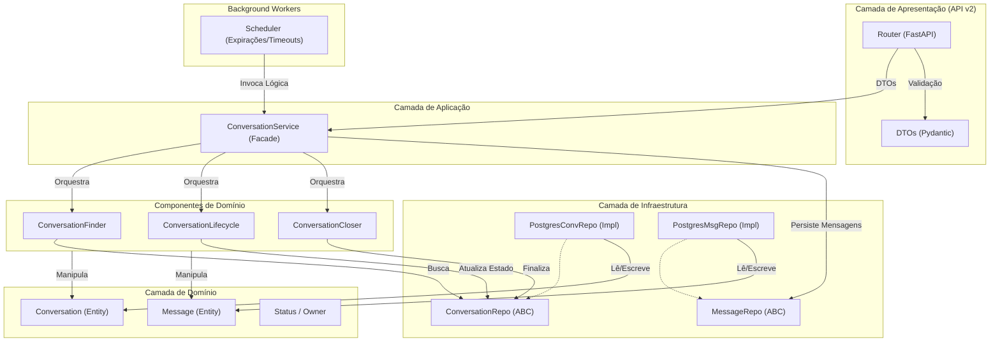

# Análise de Conformidade do Módulo `conversation`

**Data:** 05/02/2026
**Responsável:** Lennon (Arquiteto de Software AI)
**Versão:** 1.0

## 1. Sumário Executivo

O módulo `conversation` apresenta uma **maturidade arquitetural elevada**, destacando-se pela implementação robusta de **Clean Architecture** e **Domain-Driven Design (DDD)**. A separação de responsabilidades é clara, utilizando o padrão **Facade** no Serviço de Aplicação para orquestrar componentes especializados (`Finder`, `Lifecycle`, `Closer`), o que facilita a manutenção e testes.

O modelo de domínio é rico, encapsulando regras de negócio complexas (como expiração e inatividade) diretamente na entidade `Conversation`, evitando o antipadrão de Modelo Anêmico. A segurança é tratada com rigor através de validação de propriedade (`owner_id`) em profundidade ("Defense in Depth") e uso de **Optimistic Locking** para concorrência.

Entretanto, foi identificado um **risco crítico de performance e escalabilidade**: a camada de API utiliza controladores assíncronos (`async def`) que invocam repositórios síncronos baseados em `psycopg2`. Isso causa o bloqueio do *Event Loop* do FastAPI, degradando severamente a capacidade de processamento concorrente sob carga. A correção deste ponto é mandatória para ambientes de produção.

**Nota Geral:** 8.5/10 (Conforme, com ressalva crítica de performance)

---

## 2. Mapa de Responsabilidades

---

## 3. Avaliação por Categorias

### ✅ Conformidade Arquitetural
*   **Status:** ✅ Conforme
*   **Justificativa:** A estrutura de diretórios e camadas é exemplar. O uso de Injeção de Dependência (`dependency-injector`) desacopla a infraestrutura da lógica de negócio. A aplicação do padrão Facade no `ConversationService` evita "God Classes".
*   **Destaque:** Implementação de *Optimistic Locking* (`version`) para evitar sobrescrita de dados em operações concorrentes.

### 🔒 Segurança
*   **Status:** ✅ Conforme
*   **Justificativa:**
    *   **Autenticação/Autorização:** Verificação rigorosa de `owner_id` em todos os endpoints, prevenindo IDOR (Insecure Direct Object References).
    *   **Proteção de Dados:** Uso de ULIDs validados e sanitização de queries via *parameter binding* do driver SQL.
    *   **Input Validation:** Validação forte com Pydantic (`ConversationCreateDTO`).

### 🐌 Performance
*   **Status:** ⚠️ Risco Crítico
*   **Justificativa:**
    *   **Event Loop Blocking:** Controladores `async def` chamam código síncrono (`psycopg2`), bloqueando a thread principal do FastAPI. Isso anula os benefícios de performance do framework em alta carga.
    *   **Pontos Positivos:** Queries otimizadas com paginação (`LIMIT/OFFSET`) e indexação implícita por ULID.

### 🧪 Qualidade de Código
*   **Status:** ✅ Conforme
*   **Justificativa:**
    *   **Type Hints:** Cobertura de tipagem estática (`typing`, `mypy`) em quase 100% do código analisado.
    *   **Legibilidade:** Código limpo, PEP-8 compliant e bem modularizado.
    *   **Testes:** Existência de testes unitários para Services, Components e Repositories, com uso adequado de Mocks.

### 📝 Documentação e Observabilidade
*   **Status:** 🟡 Parcial
*   **Justificativa:**
    *   **Observabilidade:** Excelente rastreabilidade com logs estruturados (`logger.info(..., conv_id=...)`) e tabela de histórico de estados (`conversation_state_history`).
    *   **Documentação:** Docstrings presentes, mas breves. Swagger/OpenAPI gerado automaticamente, mas falta documentação detalhada de erros (4xx/5xx) nos decorators da API.
    *   **Tratamento de Erros:** A API captura `Exception` genérico e retorna 500, o que dificulta o diagnóstico de erros de cliente (400) vs servidor (500).

---

## 4. Pontos Fortes, Fracos e Riscos

### 💪 Pontos Fortes (Top 3)
1.  **Design de Componentes:** A quebra do serviço em `Finder`, `Lifecycle` e `Closer` torna o código extremamente modular e fácil de testar.
2.  **Riqueza do Domínio:** A entidade `Conversation` não é apenas dados; ela encapsula lógica vital (`is_expired`, `is_idle`), centralizando regras de negócio.
3.  **Auditoria de Estado:** O sistema de histórico de transições de estado é robusto e vital para debug e analytics.

### ⚠️ Pontos Fracos (Top 3)
1.  **Tratamento de Erros Genérico:** Blocos `try...except Exception` retornando 500 mascaram erros de validação e conflito.
2.  **Mistura Async/Sync:** O uso de drivers síncronos em rotas assíncronas é uma armadilha de performance.
3.  **Complexidade de Retry:** A lógica de *retry* manual para concorrência no Service (`_handle_transition_with_retry`) adiciona complexidade cognitiva; poderia ser abstraída em um decorator ou utilitário.

### 🔴 Riscos (Matriz de Prioridade)

| Risco | Probabilidade | Impacto | Prioridade |
| :--- | :---: | :---: | :---: |
| **Bloqueio do Event Loop (Async/Sync)** | Alta | Crítico | **P0 - Imediato** |
| Erros 500 mascarando 4xx | Média | Médio | P1 - Curto Prazo |
| Concorrência em Alta Carga | Baixa | Alto | P2 - Médio Prazo |

---

## 5. Plano de Ação (Top 5)

1.  **Refatoração Async (Crítico):**
    *   Remover `async` da definição dos endpoints (`def create_conversation` ao invés de `async def`) PARA JÁ, permitindo que o FastAPI execute em threadpool.
    *   *Longo prazo:* Migrar para driver assíncrono (`asyncpg`).
2.  **Melhoria no Tratamento de Erros:**
    *   Substituir `except Exception` por capturas específicas (`ConcurrencyError` -> 409, `ValueError` -> 400).
    *   Criar Exception Handlers globais se ainda não existirem.
3.  **Documentação de Erros na API:**
    *   Adicionar anotações `@router.post(..., responses={409: {"model": ErrorModel}})` para refletir os possíveis erros no Swagger.
4.  **Refatoração do Retry:**
    *   Extrair a lógica de *retry on concurrency* para um decorator `@retry_on_concurrency` reutilizável.
5.  **Revisão de Índices de Banco:**
    *   Garantir índices compostos para queries frequentes: `(owner_id, status)` e `(owner_id, session_key)`.

---

## 6. Perguntas de Arquitetura

1.  *Existe um plano para migração total para drivers assíncronos (`asyncpg`) visando suportar alta concorrência de WebSockets/Webhooks no futuro?*
2.  *A estratégia de "Optimistic Locking" é suficiente para o volume esperado, ou devemos considerar filas (Redis/BullMQ) para serializar escritas em conversas muito ativas?*
3.  *O mecanismo de expiração (`is_expired`) é verificado apenas no acesso ("lazy"). Existe um Worker em background para limpar conversas expiradas proativamente?* (R: Sim, existe `workers/scheduler.py`, mas vale revisar sua frequência).
