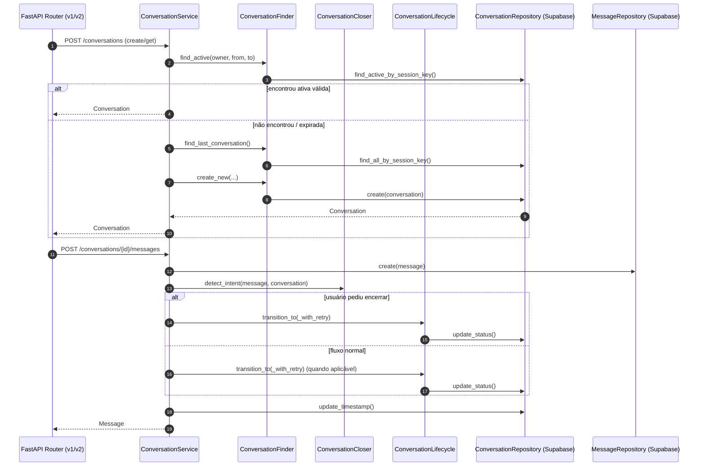
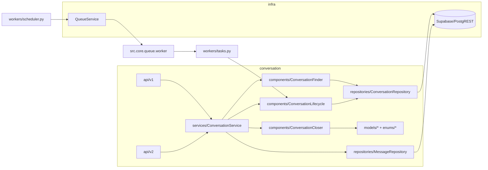

# Análise do Módulo `conversation`

Escopo: [`src/modules/conversation/`](file:///Users/lennon/projects/ai_engineering/whatsapp_twilio_ai/src/modules/conversation/)

## Visão Geral

O módulo `conversation` implementa a gestão de conversas e mensagens (persistência em Supabase/PostgREST), com rotas FastAPI versionadas (`/conversation/v1` e `/conversation/v2`), regras de ciclo de vida (máquina de estados + expiração/idle) e suporte a **human handoff**. Há uma V2 com componentes mais coesos (Finder/Lifecycle/Closer), e um `legacy_v1` ainda presente no código, porém não “roteado” no app/DI.

### Principais fluxos (alto nível)

## Perguntas de Arquitetura (para guiar evolução)

1. **Qual é a fonte de verdade do tenant (`owner_id`)?** Deve vir de autenticação/claims, header interno confiável, ou payload do cliente?
2. **Qual o contrato oficial de versionamento?** v1 e v2 coexistem por quanto tempo e o que muda de fato entre elas (schema, regras, endpoints)?
3. **Quem é “agent” no domínio?** `user_id` (end-user) vs `agent_id` (atendente) e quais invariantes de transição no handoff?
4. **Onde a máquina de estados deve morar?** Um único lugar (Lifecycle) ou também no repository (como guarda de consistência)?
5. **Como rastrear e correlacionar uma requisição ponta-a-ponta?** `correlation_id` deve ser obrigatório e propagado até logs/tarefas/DB?
6. **Quais SLOs de latência/throughput?** Isso define se Supabase síncrono em rotas `async` é aceitável ou precisa ser isolado.

---

## 1) Conformidade (Arquitetural)

✅ **Conformidade**: **Parcial (≈ 70%)**

💪 **Pontos Fortes**
- **Design REST** com rotas FastAPI e versionamento por path (`/conversation/v1`, `/conversation/v2`) em [api/router.py](file:///Users/lennon/projects/ai_engineering/whatsapp_twilio_ai/src/modules/conversation/api/router.py).
- **Camadas existentes** (API → Service → Components → Repositories → Models/DTOs/Enums), facilitando testes e evolução.
- **Coesão melhor na V2**: componentes especializados ([conversation_finder.py](file:///Users/lennon/projects/ai_engineering/whatsapp_twilio_ai/src/modules/conversation/components/conversation_finder.py), [conversation_lifecycle.py](file:///Users/lennon/projects/ai_engineering/whatsapp_twilio_ai/src/modules/conversation/components/conversation_lifecycle.py), [conversation_closer.py](file:///Users/lennon/projects/ai_engineering/whatsapp_twilio_ai/src/modules/conversation/components/conversation_closer.py)).
- **Validação de identidade ULID** nas entidades/DTOs, reduzindo risco de dados inválidos ([conversation.py](file:///Users/lennon/projects/ai_engineering/whatsapp_twilio_ai/src/modules/conversation/models/conversation.py), [message_dto.py](file:///Users/lennon/projects/ai_engineering/whatsapp_twilio_ai/src/modules/conversation/dtos/message_dto.py)).

⚠️ **Pontos Fracos**
- **Versionamento “de rota” mais que “de comportamento”**: v1 e v2 apontam para o mesmo service/repo, e v1 expõe endpoints que v2 não expõe ([v1/conversations.py](file:///Users/lennon/projects/ai_engineering/whatsapp_twilio_ai/src/modules/conversation/api/v1/conversations.py), [v2/conversations.py](file:///Users/lennon/projects/ai_engineering/whatsapp_twilio_ai/src/modules/conversation/api/v2/conversations.py)).
- **Duplicação de regras de negócio**: transições de estado estão em `ConversationLifecycle.VALID_TRANSITIONS` e também no repository em `update_status` ([conversation_lifecycle.py](file:///Users/lennon/projects/ai_engineering/whatsapp_twilio_ai/src/modules/conversation/components/conversation_lifecycle.py), [conversation_repository.py](file:///Users/lennon/projects/ai_engineering/whatsapp_twilio_ai/src/modules/conversation/repositories/conversation_repository.py)).
- **Acoplamento com infraestrutura dentro do componente de domínio**: `ConversationLifecycle` grava em `conversation_state_history` diretamente via `repository.client.table(...)` (vaza detalhe Supabase).
- **Histórico gravado em múltiplos lugares**: `ConversationRepository.update_status()` já grava histórico, e o `ConversationLifecycle` grava de novo, elevando risco de duplicidade/inconsistência.
- **Repositório com lógica de negócio**: `close_by_message_policy()` e validações de transição no repository são regra de domínio, não puro data access.
- **Arquivos grandes** (>300 linhas) dificultam manutenção: [conversation_repository.py](file:///Users/lennon/projects/ai_engineering/whatsapp_twilio_ai/src/modules/conversation/repositories/conversation_repository.py) (≈493 linhas) e `legacy_v1/services/conversation_service.py` (bem maior).

🎯 **Oportunidades (incrementais)**
- Centralizar máquina de estados e validação de transição no **Lifecycle** (repository apenas persiste, sem re-declarar regras).
- Unificar escrita de histórico em um único ponto (ex.: `ConversationStateHistoryRepository` ou método único chamado pelo Lifecycle).
- Remover/arquivar `legacy_v1` do caminho crítico (ou isolar como pacote “deprecated”), reduzindo superfície de manutenção.
- Consolidar cálculo de `session_key` (hoje duplicado em Finder e Repository).

🔴 **Riscos**
- **Alta**: inconsistência de estado/histórico por duplicação de writes e regras duplicadas (efeitos colaterais difíceis de depurar).
- **Média**: dívida técnica do `legacy_v1` causar regressões futuras por mudanças “sem perceber” em código não roteado.

**Nota geral**: boa direção na V2 (coesa), mas ainda existe “vazamento” de domínio para repositório e infra para domínio, o que reduz clareza de responsabilidades e aumenta risco de inconsistência.

---

## 2) Conformidade (Segurança)

✅ **Conformidade**: **Não conforme / Baixa (≈ 35%)**

💪 **Pontos Fortes**
- **Validação de formato ULID** reduz enumerations/ID tampering simples no nível de schema.
- Acesso ao banco via **query builder** (Supabase/PostgREST) mitiga SQL injection clássica (sem SQL string concatenada no módulo).

⚠️ **Pontos Fracos**
- **Ausência de autenticação/autorização nas rotas do módulo**: não há `Depends(...)` de auth e `owner_id` vem do payload/query, permitindo acesso cross-tenant por manipulação de parâmetros ([v1/conversations.py](file:///Users/lennon/projects/ai_engineering/whatsapp_twilio_ai/src/modules/conversation/api/v1/conversations.py), [v2/conversations.py](file:///Users/lennon/projects/ai_engineering/whatsapp_twilio_ai/src/modules/conversation/api/v2/conversations.py)).
- **Multitenancy por “confiança no cliente”**: endpoints listam conversas por `owner_id` em query string; sem RBAC/claims, qualquer caller pode consultar qualquer tenant.
- **Erro 500 vazando detalhe interno**: `HTTPException(detail=str(e))` expõe mensagens de infra (padrão repetido em várias rotas).
- **Segredo JWT com default inseguro**: `SecuritySettings.secret_key` default `"change-me-in-production"` cria risco de deploy com chave fraca se `.env` não estiver correto ([settings.py](file:///Users/lennon/projects/ai_engineering/whatsapp_twilio_ai/src/core/config/settings.py)).
- **Sem rate limiting** nas rotas de conversa (risco de abuso/DoS e custos de infra).
- **Sem validações de tamanho/normalização** para campos de texto (`body`, `metadata`) e telefone (risco de payloads enormes, log injection e consumo excessivo).

🎯 **Oportunidades (incrementais)**
- Definir um **mecanismo único de autenticação** para API (JWT/OAuth2 ou API-key interna), e derivar `owner_id` do contexto autenticado (claim/header confiável), nunca do payload.
- Implementar autorização mínima (RBAC por `owner_id`, e autorização por conversa: `conv.owner_id` deve sempre bater com o contexto).
- Padronizar respostas de erro: retornar `detail="Internal server error"` e registrar `error_id` no log; evitar `str(e)` no response.
- Adicionar **rate limiting** (por IP/tenant) nas rotas públicas.
- Adicionar limites/validações: tamanho máximo de `body`, whitelist de campos em `metadata`, sanitização para logs.

🔴 **Riscos**
- **Alta**: vazamento de dados entre tenants e alterações indevidas (broken access control – OWASP A01).
- **Média**: exposição de detalhes internos/infra em erros (OWASP A05/A09), facilitando exploração e troubleshooting adversário.
- **Média**: abuse/DoS e custos, por ausência de rate limiting.

**Nota geral**: a modelagem está pronta para multitenancy, mas falta o “guard rail” essencial: autenticar e autorizar todas as rotas e jamais confiar `owner_id` fornecido pelo cliente.

---

## 3) Conformidade (Performance)

✅ **Conformidade**: **Parcial (≈ 60%)**

💪 **Pontos Fortes**
- Queries são, em geral, **diretas** (sem N+1 típico de ORM), usando filtros e paginação (`limit/offset`) em mensagens ([message_repository.py](file:///Users/lennon/projects/ai_engineering/whatsapp_twilio_ai/src/modules/conversation/repositories/message_repository.py)).
- `version` + optimistic locking e retry em transições reduz race conditions em escrita concorrente ([conversation_service.py](file:///Users/lennon/projects/ai_engineering/whatsapp_twilio_ai/src/modules/conversation/services/conversation_service.py)).

⚠️ **Pontos Fracos**
- Rotas FastAPI são `async def`, mas as chamadas Supabase/DB no módulo são **síncronas**: isso pode bloquear o event loop e degradar throughput sob carga.
- Várias queries fazem `select("*")`, incluindo `context/metadata` (potencialmente grandes), elevando payload e latência.
- **Sem caching** para leituras frequentes (ex.: `get_conversation_by_id`, listagens, handoff queue).
- Processos periódicos (`process_idle/expired`) varrem candidatos e atualizam um a um; sem “bulk update”/RPC pode ser lento em alto volume.

🎯 **Oportunidades (incrementais)**
- Tornar handlers **sync** (`def`) ou isolar IO síncrono em threadpool (evitar `async` enganoso). Alternativa: migrar para cliente async, se existir no stack.
- Ajustar selects para campos necessários (especialmente em listagens), reduzindo payload.
- Caching em Redis por `conv_id` e por “listas quentes” com TTL curto (ex.: 10–30s), se o caso de uso justificar.
- Para tarefas periódicas: otimizar com filtros/indexes (ex.: índices em `expires_at`, `updated_at`, `status`) e considerar operações em lote.

🔴 **Riscos**
- **Média**: degradação sob carga por bloqueio do loop asyncio e payload excessivo.
- **Baixa/Média**: aumento de custo do banco e latência em listagens conforme volume cresce.

**Nota geral**: não há sinais de N+1 clássico, mas a combinação `async` + IO síncrono e `select("*")` tende a aparecer como gargalo quando o tráfego cresce.

---

## 4) Conformidade (Documentação)

✅ **Conformidade**: **Parcial (≈ 55%)**

💪 **Pontos Fortes**
- FastAPI gera **OpenAPI/Swagger** automaticamente em dev ([main.py](file:///Users/lennon/projects/ai_engineering/whatsapp_twilio_ai/src/main.py)).
- Docstrings existem nas rotas principais e em componentes.
- Há documentação do projeto e diagramas em `docs/` e `plan/` (fora do módulo), útil como base de referência.

⚠️ **Pontos Fracos**
- `docs_url` e `openapi_url` são desativados em produção (ok por segurança), mas falta uma estratégia alternativa (publicação de spec/versionamento).
- DTOs têm docstrings genéricas/desatualizadas (“Updated domain models...”), reduzindo valor de documentação técnica ([conversation_dto.py](file:///Users/lennon/projects/ai_engineering/whatsapp_twilio_ai/src/modules/conversation/dtos/conversation_dto.py), [message_dto.py](file:///Users/lennon/projects/ai_engineering/whatsapp_twilio_ai/src/modules/conversation/dtos/message_dto.py)).
- Estratégia de versionamento não está explicitada (o que muda em v2, ciclo de vida da v1, compatibilidade).

🎯 **Oportunidades (incrementais)**
- Documentar contrato de API do módulo: endpoints, erros padrão, modelo de auth e multitenancy.
- Documentar máquina de estados (invariantes + transições) e como o histórico é persistido.
- Definir “política de versionamento”: compatibilidade, deprecação, e diferenças reais entre v1 e v2.

🔴 **Riscos**
- **Média**: integrações externas frágeis (consumidores não sabem o que esperar de v1/v2 e de erros).
- **Baixa/Média**: regressões de negócio por regras duplicadas/implícitas não documentadas.

**Nota geral**: existe documentação “automática” (OpenAPI) e algum texto, mas falta uma documentação do domínio e do contrato de versionamento do módulo.

---

## 5) Conformidade (Observabilidade)

✅ **Conformidade**: **Parcial (≈ 60%)**

💪 **Pontos Fortes**
- Uso de logging via `get_logger` e registros com campos (ex.: `conv_id`, `status`) em partes do fluxo ([conversation_service.py](file:///Users/lennon/projects/ai_engineering/whatsapp_twilio_ai/src/modules/conversation/services/conversation_service.py), [conversation_lifecycle.py](file:///Users/lennon/projects/ai_engineering/whatsapp_twilio_ai/src/modules/conversation/components/conversation_lifecycle.py)).
- Health check simples no app ([main.py](file:///Users/lennon/projects/ai_engineering/whatsapp_twilio_ai/src/main.py)).
- `correlation_id` existe no modelo/DTO de mensagem, abrindo caminho para tracing.

⚠️ **Pontos Fracos**
- Logs misturam estrutura com `f-strings` e não padronizam `exc_info`, reduzindo observabilidade e dificultando agregação.
- Ausência de tracing distribuído real (propagação e uso consistente de `correlation_id`).
- Tratamento de erros: APIs convertem exceções genéricas em 500 com detalhe (vazamento) e sem categorização (4xx vs 5xx) consistente.
- Sem métricas (latência, taxa de erros, backlog do scheduler/worker, transições por status).

🎯 **Oportunidades (incrementais)**
- Padronizar logging: sempre campos estruturados + `exc_info=True` quando houver exceção.
- Tornar `correlation_id` obrigatório em fluxos externos (webhook/requests) e propagar para logs e mensagens.
- Adicionar métricas: contadores de transições, duração de request, filas (enqueued/processed/failures).
- Criar endpoints adicionais: readiness (dependências) e métricas (se houver stack para isso).

🔴 **Riscos**
- **Média**: baixa capacidade de diagnóstico em incidentes (timeout, concorrência, duplicação de estado).
- **Baixa/Média**: troubleshooting caro por falta de métricas e rastreamento.

**Nota geral**: o logging existe, mas precisa ser uniformizado e conectado ao `correlation_id` para observabilidade de verdade.

---

## 6) Conformidade (Dependências)

✅ **Conformidade**: **Parcial (≈ 55%)**

💪 **Pontos Fortes**
- Dependências principais estão **pinadas** com versão fixa no `requirements.txt` (reduz “works on my machine”).
- Uso de libs maduras (FastAPI, Pydantic, structlog, supabase, pytest).

⚠️ **Pontos Fracos**
- Ausência de rotina de **SCA** (pip-audit/safety) e monitoramento de CVEs na pipeline.
- `bullmq>=...` e `redis>=...` estão sem upper bound (risco de breaking changes).
- Não há inventário de licenças e política de compatibilidade (importante para deploy/cliente enterprise).

🎯 **Oportunidades (incrementais)**
- Adicionar verificação automatizada de CVEs (ex.: `pip-audit`) e licenças (ex.: `pip-licenses`) em CI.
- Fixar ranges com upper bound para dependências críticas (sem “>=” aberto).
- Gerar SBOM (ex.: CycloneDX) para rastreabilidade.

🔴 **Riscos**
- **Média**: atualização indireta quebrar runtime (especialmente em filas).
- **Média**: exposição a CVEs conhecidas sem detecção (supply chain).

**Nota geral**: base razoável, mas falta governança automatizada (CVE/licença/SBOM).

---

## 7) Conformidade (Deploy/DevOps)

✅ **Conformidade**: **Parcial (≈ 50%)**

💪 **Pontos Fortes**
- Dockerfile slim e execução como usuário não-root ([Dockerfile](file:///Users/lennon/projects/ai_engineering/whatsapp_twilio_ai/Dockerfile)).
- `docker-compose.yml` define serviços essenciais (api/worker/scheduler + postgres/redis) e healthchecks ([docker-compose.yml](file:///Users/lennon/projects/ai_engineering/whatsapp_twilio_ai/docker-compose.yml)).
- Princípios de 12-factor parcialmente seguidos (config via env vars).

⚠️ **Pontos Fracos**
- Healthcheck do Dockerfile usa `requests`, mas o pacote **não está no `requirements.txt`** (healthcheck tende a falhar).
- Sem CI/CD visível (ex.: GitHub Actions), sem gates de qualidade (lint/test/audit).
- `docker-compose.yml` embute credenciais default (aceitável para dev), mas sem orientação clara de produção (secrets, vault, rotação).
- Sem estratégia explícita de rollback/release (tagging, migrações, compatibilidade).

🎯 **Oportunidades (incrementais)**
- Corrigir healthcheck (usar `curl`/`wget` no container, ou adicionar `requests` explicitamente).
- Implementar pipeline mínima: lint + testes + security audit + build de imagem.
- Separar perfis dev/prod e secrets management (ex.: variables via `.env`, secrets do orchestrator).
- Estratégia de migração/rollback: migrações idempotentes e controle de versão no deploy.

🔴 **Riscos**
- **Média**: deploy instável por healthcheck quebrado e ausência de pipeline.
- **Baixa/Média**: incidentes por config incorreta/segredos fracos se não houver disciplina operacional.

**Nota geral**: containerização está bem encaminhada, mas falta automação (CI) e robustez (healthcheck confiável, secrets e rollback).

---

## Nota Geral (módulo `conversation`)

**Nota geral**: **6,2 / 10**

Prioridades recomendadas (ordem sugerida):
1. **Segurança / Multitenancy**: autenticação + autorização e derivar `owner_id` do contexto (Alta).
2. **Consistência de domínio**: unificar máquina de estados e histórico em um ponto (Alta).
3. **Performance**: evitar `async` com IO síncrono e reduzir `select("*")` (Média).
4. **Observabilidade**: padronizar logs, usar `correlation_id`, adicionar métricas (Média).
5. **DevOps/Dependências**: CI com tests/audit/licenças; corrigir healthcheck (Média).

## Relatório breve (reflexões e sugestões)

O módulo tem uma base sólida e mostra evolução clara: a V2 introduz decomposição em componentes (Finder/Lifecycle/Closer), o que melhora coesão e reduz o acoplamento “service monolítico”. A modelagem com ULID e optimistic locking é um bom avanço para robustez e concorrência.

O maior risco atual está fora do “código bonito”: **segurança e isolamento por tenant**. Sem autenticação/autorização, o módulo fica vulnerável a acesso indevido, e isso é crítico em sistemas multi-tenant. Em paralelo, a duplicação de máquina de estados/histórico (Lifecycle + Repository) é o tipo de problema que não falha em teste simples, mas gera inconsistências difíceis de depurar em produção. A recomendação é atacar primeiro esses dois pontos para estabilizar a evolução do domínio.

