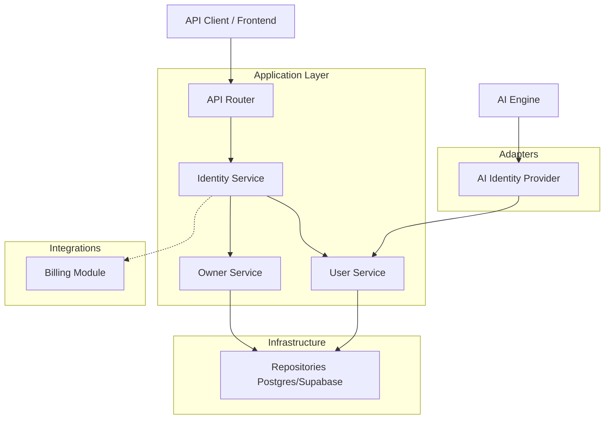
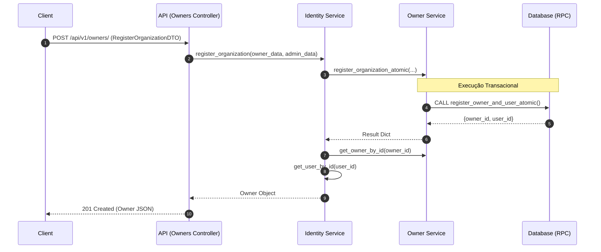
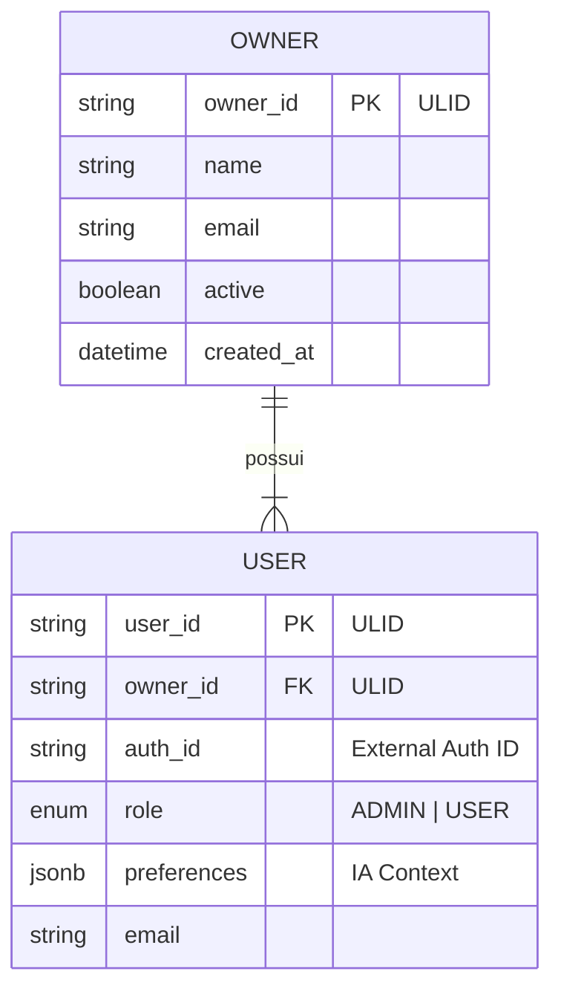

# Módulo Identity (WhatsApp Twilio AI)


## Descrição

O módulo **Identity** é o coração da gestão de identidades e acesso da plataforma WhatsApp Twilio AI. Ele é responsável pelo ciclo de vida de **Owners** (Organizações/Tenants) e **Users** (Usuários), garantindo a segurança, consistência e persistência de preferências.

Atua como um orquestrador central para o registro atômico de novas organizações, integrando-se nativamente com o módulo de **Billing** para provisionamento de recursos. Além disso, fornece adaptadores estratégicos para alimentar o motor de IA com contexto personalizado do usuário em tempo real.

## Preview

*(Placeholder para screenshots ou diagramas visuais da arquitetura)*

## Funcionalidades Principais

*   **Registro Atômico de Organização**: Criação de `Owner` e `User` (Admin) em uma única transação segura (Atomic RPC), prevenindo estados inconsistentes.
*   **Gestão de Usuários e Perfis**: Gerenciamento completo de dados cadastrais e preferências de usuário (armazenadas via JSONB para flexibilidade).
*   **Integração com IA (Adapter Pattern)**: O `AIIdentityProvider` atua como uma ponte, permitindo que o motor de IA acesse preferências e contexto do usuário sem acoplamento direto com a lógica de persistência.
*   **Identificadores Seguros**: Utilização de **ULID** (Universally Unique Lexicographically Sortable Identifier) para chaves primárias, garantindo ordenação e segurança.
*   **Controle de Acesso (RBAC)**: Definição clara de papéis (`UserRole`) como ADMIN e USER.
*   **Arquitetura Hexagonal (Ports & Adapters)**: Separação clara entre Domínio, Aplicação e Infraestrutura.

## Tecnologias Utilizadas

*   **Linguagem**: Python 3.12+
*   **Framework Web**: FastAPI
*   **Validação de Dados**: Pydantic v2
*   **Banco de Dados**: PostgreSQL / Supabase (via Repository Pattern)
*   **Padrões de Projeto**: Clean Architecture, Repository Pattern, Adapter Pattern, Dependency Injection.

## Diagramas de Arquitetura

### 1. Visão Geral da Solução (Componentes)



### 2. Fluxo de Registro de Organização (Sequência)



### 3. Modelo de Dados Simplificado (ERD)



## Pré-requisitos

*   **Python 3.12** ou superior instalado.
*   **Gerenciador de Dependências**: `uv` ou `pip`.
*   Acesso a uma instância **Supabase** ou **PostgreSQL** configurada.
*   Variáveis de ambiente configuradas no arquivo `.env` na raiz do projeto.

## Instalação

Como este é um módulo parte de um monorepo/projeto maior, a instalação segue o padrão do projeto raiz:

1.  **Clone o repositório:**
    ```bash
    git clone https://github.com/seu-org/whatsapp-twilio-ai.git
    cd whatsapp-twilio-ai
    ```

2.  **Crie e ative o ambiente virtual:**
    ```bash
    python -m venv .venv
    source .venv/bin/activate  # Linux/Mac
    # .venv\Scripts\activate  # Windows
    ```

3.  **Instale as dependências:**
    ```bash
    pip install -r requirements.txt
    ```

4.  **Configure o ambiente:**
    Copie o exemplo e preencha com suas credenciais:
    ```bash
    cp .env.example .env
    ```

## Uso

### Exemplo: Registrando uma Nova Organização

```python
import requests

url = "http://localhost:8000/api/v1/owners/"
payload = {
    "name": "Minha Empresa Tech",
    "email": "contato@minhaempresa.com",
    "auth_id": "auth0|123456789",
    "first_name": "Lennon",
    "last_name": "Admin"
}

response = requests.post(url, json=payload)
print(response.json())
```

### Exemplo: Integração com IA (Interno)

```python
from src.modules.identity.adapters.ai_identity_provider import AIIdentityProvider
from src.core.di.container import Container

# Resolvendo via Container de Injeção de Dependência
provider = Container.ai_identity_provider()
preferences = provider.get_user_preferences(user_id="01HR...")

print(f"Preferências do Usuário para IA: {preferences}")
```

## Estrutura de Pastas

```
src/modules/identity/
├── adapters/          # Adaptadores para sistemas externos (ex: IA)
├── api/               # Controladores e Rotas da API (FastAPI)
│   └── v1/
├── docs/              # Documentação técnica e ADRs
├── dtos/              # Data Transfer Objects (Pydantic)
├── enums/             # Enumerações (ex: UserRole)
├── helpers/           # Funções auxiliares e validações
├── models/            # Modelos de Domínio e Banco de Dados
├── repositories/      # Camada de Acesso a Dados (Interfaces e Impl)
├── services/          # Regras de Negócio e Casos de Uso
└── utils/             # Utilitários específicos do módulo
```

## Contribuição

1.  Faça um Fork do projeto.
2.  Crie uma Branch para sua Feature (`git checkout -b feature/MinhaFeature`).
3.  Faça o Commit de suas mudanças (`git commit -m 'Add some AmazingFeature'`).
4.  Faça o Push para a Branch (`git push origin feature/MinhaFeature`).
5.  Abra um Pull Request.

## Licença

Este projeto está licenciado sob a licença **MIT** - veja o arquivo [LICENSE](LICENSE) para detalhes.

## Contato

**Equipe Engenharia**

*   **Lead Engineer / Autor**: Lennon
*   **Email**: lennonconstantino@gmail.com
*   **Time**: AI Engineering Team
