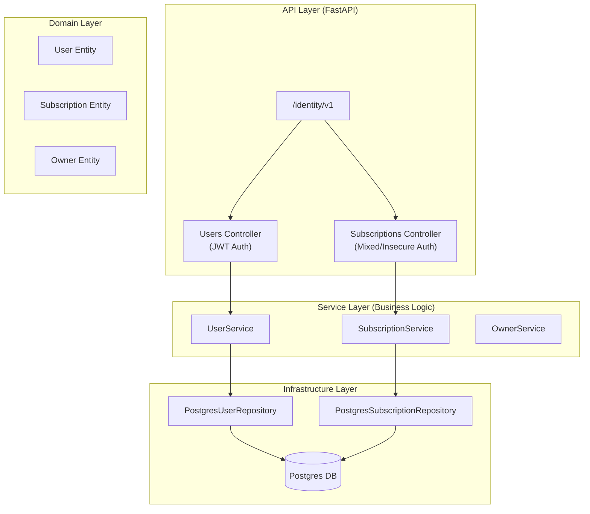
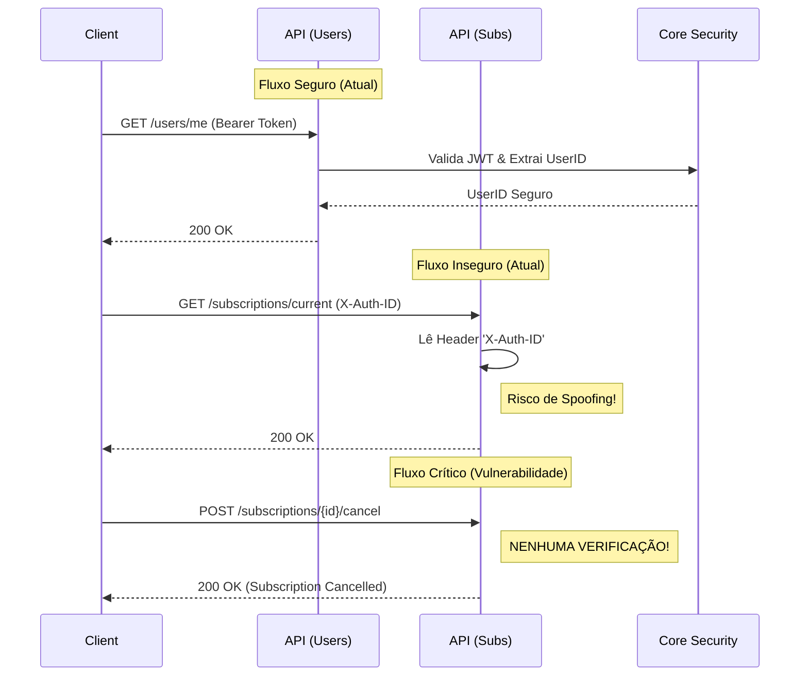

# Análise de Conformidade — Módulo `identity`

**Contexto:**
- **Stack:** FastAPI + Dependency Injector + Pydantic + Postgres (via SQLAlchemy/Session)
- **Tamanho:** ~43 arquivos Python (~2.8k linhas)
- **Criticidade:** Alta (Core Domain: Gestão de Usuários, Tenants e Assinaturas)

## 1. Sumário Executivo

O módulo `identity` apresenta uma base arquitetural sólida, utilizando **Clean Architecture** com injeção de dependência e separação clara de responsabilidades (API, Service, Repository). A cobertura de testes é alta (~89%) e o uso de tipagem estática é consistente.

Entretanto, o módulo sofre de **inconsistências críticas de segurança e padronização**. Enquanto alguns endpoints (ex: `/users`) utilizam o padrão seguro do projeto (JWT Bearer Token via `src.core.security`), outros (ex: `/subscriptions`) dependem de um header `X-Auth-ID` inseguro e validado manualmente. Mais grave ainda, existem endpoints sensíveis como o cancelamento de assinatura totalmente desprotegidos (Broken Access Control).

A camada de persistência utiliza uma implementação baseada em Postgres (`PostgresRepository`), indicando uma arquitetura preparada para bancos relacionais tradicionais, embora a documentação anterior mencionasse Supabase/PostgREST.

**Recomendação Imediata:** Corrigir a vulnerabilidade de **IDOR** no endpoint de cancelamento de assinatura e padronizar toda a autenticação para usar o mecanismo de JWT do `core`, removendo a dependência do header `X-Auth-ID`.

## 2. Mapa de Responsabilidades

## 3. Avaliação por Categorias

### 3.1 Arquitetural
- ✅ **Conformidade:** Parcial
- 💪 **Pontos Fortes:**
    - **Injeção de Dependência:** Uso consistente de `dependency_injector` facilita testes e desacoplamento.
    - **Separação de Camadas:** Respeita bem a divisão entre Router, Service e Repository.
    - **Protocolos:** Uso de `Protocol` para interfaces de repositório (`IUserRepository`) permite fácil substituição (mocking/troca de DB).
- ⚠️ **Pontos Fracos:**
    - **Inconsistência de Padrões:** Coexistência de dois padrões de autenticação (JWT vs Header Manual).
    - **Vazamento de Lógica:** Validações de permissão (Admin/Owner) feitas manualmente dentro dos controllers (`if user.role != ADMIN`) em vez de decoradores ou dependências reutilizáveis.
    - **Modelos Híbridos:** Algumas classes Pydantic atuam como DTOs e Entidades de Domínio simultaneamente, o que pode acoplar a API ao banco.

### 3.2 Segurança
- 🔴 **Conformidade:** **Não Conforme (Crítico)**
- 💪 **Pontos Fortes:**
    - Validação de tipos com Pydantic previne injeção de dados básicos.
    - Uso de JWT implementado no `core` (embora não usado em tudo).
- 🔴 **Riscos Críticos:**
    - **Broken Access Control (IDOR):** O endpoint `POST /subscriptions/{id}/cancel` não valida autenticação nem autorização. Qualquer pessoa com o ID da assinatura pode cancelá-la.
    - **Autenticação Fraca:** Endpoints de assinatura confiam no header `X-Auth-ID` sem validação criptográfica (se o gateway não sanitizar, permite spoofing de identidade).
    - **Autorização Manual:** Checagens de `owner_id` repetidas manualmente aumentam a chance de esquecimento (como ocorreu no cancelamento).

### 3.3 Qualidade de Código
- ✅ **Conformidade:** Alta
- 💪 **Pontos Fortes:**
    - **Type Hints:** Cobertura quase total de tipagem estática.
    - **Linting:** Código segue padrões PEP 8 (com ressalvas menores).
    - **Testabilidade:** Arquitetura favorece testes unitários isolados.
- ⚠️ **Pontos Fracos:**
    - **Duplicação de Código:** Lógica de busca de usuário por `auth_id` repetida em vários endpoints.
    - **Tratamento de Erros:** Alguns blocos `try/except` capturam exceções genéricas e retornam 400 com a mensagem do erro crua (`detail=str(e)`), podendo vazar detalhes de implementação.

### 3.4 Performance
- ✅ **Conformidade:** Conforme
- 💪 **Pontos Fortes:**
    - **Queries Simples:** O padrão de repositório mantém as queries controladas.
    - **Async:** A estrutura permite migração para async (embora os repositórios atuais pareçam síncronos via SQLAlchemy Session).
- ⚠️ **Pontos Fracos:**
    - **Falta de Async IO:** A implementação atual do repositório Postgres parece ser síncrona (`def` em vez de `async def`), o que pode bloquear o event loop do FastAPI sob carga.

### 3.5 Documentação
- ✅ **Conformidade:** Parcial
- 💪 **Pontos Fortes:**
    - **OpenAPI:** Endpoints bem descritos via Pydantic/FastAPI.
    - **Docstrings:** Presentes na maioria dos serviços e repositórios.
- ⚠️ **Pontos Fracos:**
    - **Falta de Contexto:** Não há explicação sobre por que existem dois métodos de auth.
    - **README:** Ausência de documentação específica do módulo explicando o fluxo de on-boarding e features.

### 3.6 Observabilidade
- ✅ **Conformidade:** Parcial
- 💪 **Pontos Fortes:**
    - **Logging:** Uso de `src.core.utils.get_logger`.
- ⚠️ **Pontos Fracos:**
    - **Falta de Contexto nos Logs:** Logs não parecem incluir `request_id` ou `tenant_id` automaticamente, dificultando rastreio em produção.

### 3.7 Dependências
- ✅ **Conformidade:** Conforme
- **Status:** Stack padrão e bem mantida (FastAPI, Pydantic, SQLAlchemy/Postgres). Sem dependências exóticas ou obsoletas identificadas no escopo.

## 4. Diagramas

### Fluxo de Autenticação (Atual vs Ideal)

## 5. Matriz de Priorização

| Risco | Impacto | Esforço | Item |
|:---:|:---:|:---:|:---|
| 🔴 Crítico | Alto | Baixo | **Corrigir endpoint `cancel_subscription`** (Adicionar Auth). |
| 🔴 Crítico | Alto | Médio | **Padronizar Auth em Subscriptions** (Migrar `X-Auth-ID` para JWT). |
| ⚠️ Médio | Médio | Médio | **Refatorar Repositórios para Async** (Evitar bloqueio do Event Loop). |
| ⚠️ Médio | Baixo | Baixo | **Padronizar Tratamento de Erros** (Remover `detail=str(e)`). |

## 6. Plano de Ação

1.  **HOTFIX Segurança:** Adicionar `Depends(get_current_user_id)` e validação de `owner_id` no endpoint `cancel_subscription` imediatamente.
2.  **Padronização de Auth:** Refatorar `src/modules/identity/api/v1/subscriptions.py` para usar `get_current_user_id` e `get_current_owner_id` do `src.core.security`, eliminando o header `X-Auth-ID`.
3.  **Refatoração de Permissions:** Criar dependências reutilizáveis para permissões (ex: `RequiresRole(ADMIN)`), removendo ifs repetitivos dos controllers.
4.  **Review de Exception Handling:** Auditar todos os `catch Exception` para garantir que mensagens de erro internas não vazem para o cliente.
5.  **Documentação:** Atualizar README do módulo documentando o modelo de permissões e fluxos de assinatura.

## 7. Perguntas de Arquitetura

1.  Por que o módulo de assinaturas usa um padrão de autenticação diferente (`X-Auth-ID`) do restante do sistema? Existe algum requisito de gateway legado?
2.  Os repositórios Postgres estão implementados de forma síncrona. Existe plano para migrar para `AsyncSession` do SQLAlchemy para aproveitar o loop do FastAPI?
3.  Qual é a fonte da verdade para o `auth_id`? O sistema suporta múltiplos provedores de identidade ou é acoplado a um específico?

## 8. Nota Geral da Avaliação

**Nota: 5.0 / 10**

> **Justificativa:** Embora a arquitetura base e a qualidade de código sejam de nível 8/10, as falhas críticas de segurança (endpoints públicos destrutivos e auth insegura em assinaturas) derrubam a nota para um nível de "Não Conforme" em segurança. A correção desses itens elevaria a nota rapidamente para 8.0+.
