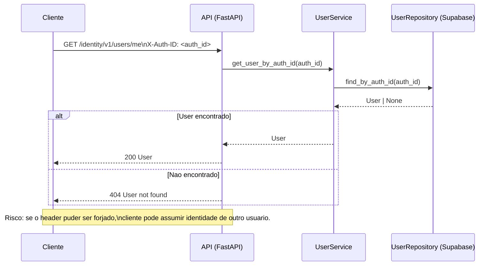
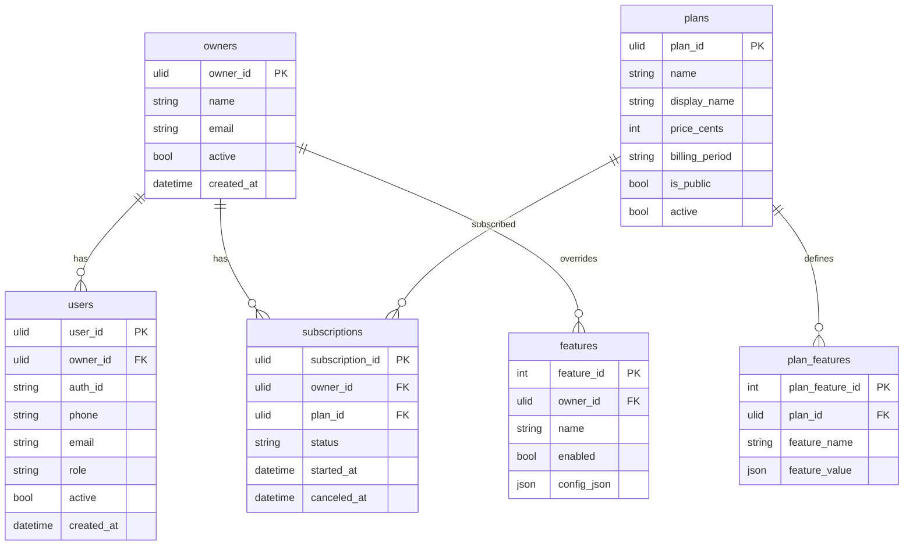

# Analise de Conformidade — Modulo `identity`

Escopo: apenas o codigo em `src/modules/identity/` (infra/deploy fora do modulo foi ignorado, exceto referencias diretas que afetam o comportamento do identity).

- Stack observada: FastAPI + dependency-injector + Pydantic + Supabase (PostgREST) via `SupabaseRepository`
- Tamanho do modulo: 43 arquivos Python (~2820 linhas) e 86 arquivos no total
- Criticidade (avaliacao): Alta (tenant/user/subscription/feature gating)

## TOC
- [1. Sumario Executivo](#1-sumario-executivo)
- [2. Mapa de Responsabilidades](#2-mapa-de-responsabilidades)
- [3. Avaliacao por Categorias](#3-avaliacao-por-categorias)
  - [3.1 Arquitetural](#31-arquitetural)
  - [3.2 Seguranca](#32-seguranca)
  - [3.3 Qualidade de Codigo](#33-qualidade-de-codigo)
  - [3.4 Performance](#34-performance)
  - [3.5 Documentacao](#35-documentacao)
  - [3.6 Observabilidade](#36-observabilidade)
  - [3.7 Dependencias](#37-dependencias)
- [4. Diagramas](#4-diagramas)
  - [4.1 Componentes (Modulo Identity)](#41-componentes-modulo-identity)
  - [4.2 Fluxo de Autenticacao (Sequencia)](#42-fluxo-de-autenticacao-sequencia)
  - [4.3 Modelo de Dados (ER)](#43-modelo-de-dados-er)
- [5. Matriz de Priorizacao (Risco x Esforco)](#5-matriz-de-priorizacao-risco-x-esforco)
- [6. Plano de Acao (Top 5)](#6-plano-de-acao-top-5)
- [7. Perguntas de Arquitetura](#7-perguntas-de-arquitetura)
- [8. Nota Geral](#8-nota-geral)
- [9. Reflexoes e Sugestoes](#9-reflexoes-e-sugestoes)

---

## 1. Sumario Executivo
O modulo `identity` esta bem estruturado em camadas (API → Services → Repositories → Supabase) e possui bom nivel de testes automatizados (153 testes passando e ~89% de cobertura do modulo). A separacao por agregados (Owner/User/Plan/Subscription/Feature) e o uso de DI via `dependency_injector` facilitam evolucao e testabilidade, mantendo o codigo relativamente coeso e com responsabilidades claras.

Os maiores gaps estao em **seguranca e governanca de autorizacao**. O modulo se apoia em `X-Auth-ID` como “identidade externa” sem validacao criptografica (JWT/Bearer) e com checagens ad-hoc; alguns endpoints criticos nao validam owner/role (ex.: cancelamento de assinatura). Isso cria uma superficie de ataque relevante caso a API esteja exposta. Existem tambem inconsistencias de modelagem entre DTOs e Models (ex.: `email` e `auth_id`/`external_auth_id`), e codigo potencialmente “orfao”/duplicado (ex.: `models/response.py`) que aumenta custo de manutencao e risco de divergencia.

Recomendacao: priorizar a centralizacao de autenticacao/autorizacao via dependencias do FastAPI, fortalecer RBAC (incluindo “admin only” onde previsto), e alinhar contrato de dados (DTOs ↔ Model ↔ colunas Supabase). Em seguida, atacar quick wins de qualidade (tipagem, defaults mutaveis, limpeza de utilitarios deslocados) e robustez de operacoes multi-etapas (transacao/consistencia no onboarding e troca de assinaturas).

---

## 2. Mapa de Responsabilidades
Este mapa resume o modulo como um “bounded context” de Identidade e Assinaturas (multi-tenant).

<details>
<summary>Notas de leitura (arquivos-chave)</summary>

- Routers: [router.py](file:///Users/lennon/projects/ai_engineering/whatsapp_twilio_ai/src/modules/identity/api/router.py), [v1/router.py](file:///Users/lennon/projects/ai_engineering/whatsapp_twilio_ai/src/modules/identity/api/v1/router.py)
- Endpoints: [users.py](file:///Users/lennon/projects/ai_engineering/whatsapp_twilio_ai/src/modules/identity/api/v1/users.py), [owners.py](file:///Users/lennon/projects/ai_engineering/whatsapp_twilio_ai/src/modules/identity/api/v1/owners.py), [plans.py](file:///Users/lennon/projects/ai_engineering/whatsapp_twilio_ai/src/modules/identity/api/v1/plans.py), [subscriptions.py](file:///Users/lennon/projects/ai_engineering/whatsapp_twilio_ai/src/modules/identity/api/v1/subscriptions.py), [features.py](file:///Users/lennon/projects/ai_engineering/whatsapp_twilio_ai/src/modules/identity/api/v1/features.py)
- Orquestracao: [IdentityService](file:///Users/lennon/projects/ai_engineering/whatsapp_twilio_ai/src/modules/identity/services/identity_service.py)
- Repos (Supabase): [repositories/](file:///Users/lennon/projects/ai_engineering/whatsapp_twilio_ai/src/modules/identity/repositories)
</details>

---

## 3. Avaliacao por Categorias

### 3.1 Arquitetural
- ✅ Conformidade: Parcial
- 💪 Pontos Fortes (Top 3):
  - Camadas claras e testaveis (API → Services → Repos) com DI consistente.
  - Separacao por agregados (Owner/User/Plan/Subscription/Feature) facilita evolucao.
  - Versionamento de API explicito: `/identity/v1` ([api/router.py](file:///Users/lennon/projects/ai_engineering/whatsapp_twilio_ai/src/modules/identity/api/router.py#L5-L7)).
- ⚠️ Pontos Fracos (Top 3):
  - Boundary de camadas “vaza” (ex.: `IdentityService` acessa `plan_service.plan_repository` diretamente) ([identity_service.py:L134-L145](file:///Users/lennon/projects/ai_engineering/whatsapp_twilio_ai/src/modules/identity/services/identity_service.py#L134-L145)).
  - Duplicacao/risco de divergencia entre DTOs e models (ex.: `models/response.py` vs DTOs de API) ([response.py](file:///Users/lennon/projects/ai_engineering/whatsapp_twilio_ai/src/modules/identity/models/response.py)).
  - Utilitario `PathValidator` parece deslocado do dominio e hardcoded para “finance” ([validates.py](file:///Users/lennon/projects/ai_engineering/whatsapp_twilio_ai/src/modules/identity/helpers/validates.py#L19-L86)).
- 🔴 Riscos (criticos primeiro):
  - Duplicacao de contrato e naming inconsistente (`auth_id` vs `external_auth_id`) pode quebrar integrações silenciosamente.
  - Operacoes multi-etapas sem transacao (onboarding e troca de assinatura) podem gerar estados intermediarios.
- 🎯 Oportunidades:
  - Quick win: remover/realocar `models/response.py` se nao usado; alinhar DTOs a Models.
  - Estrutural: criar camada de “auth context” (Depends) para padronizar `current_user`/RBAC.
- 📊 Nota: 6.5/10

<details>
<summary>Detalhes tecnicos</summary>

- O modulo segue um estilo “DDD-lite”: `Owner` como tenant, `User` como membro, `Subscription` e `Plan` para billing, `Feature` como override por tenant.
- Interfaces Protocol (ex.: [interfaces.py](file:///Users/lennon/projects/ai_engineering/whatsapp_twilio_ai/src/modules/identity/repositories/interfaces.py)) aumentam substituibilidade e ajudam testes.
</details>

### 3.2 Seguranca
- ✅ Conformidade: Nao Conforme (para cenarios de API exposta)
- 💪 Pontos Fortes (Top 3):
  - Validacao de ULID e campos em models/DTOs reduz “input lixo” e erros de dados ([user.py](file:///Users/lennon/projects/ai_engineering/whatsapp_twilio_ai/src/modules/identity/models/user.py#L63-L78), [feature_dto.py](file:///Users/lennon/projects/ai_engineering/whatsapp_twilio_ai/src/modules/identity/dtos/feature_dto.py#L17-L23)).
  - Sem secrets hardcoded no modulo (config vem de `settings`, nao do codigo).
  - Sanitizacao basica de path evita `..` (embora o utilitario esteja deslocado) ([validates.py](file:///Users/lennon/projects/ai_engineering/whatsapp_twilio_ai/src/modules/identity/helpers/validates.py#L44-L49)).
- ⚠️ Pontos Fracos (Top 3):
  - Autenticacao baseada em header (`X-Auth-ID`) sem validacao criptografica permite spoofing se a API for chamavel por terceiros ([users.py:L22-L34](file:///Users/lennon/projects/ai_engineering/whatsapp_twilio_ai/src/modules/identity/api/v1/users.py#L22-L34)).
  - Autorizacao inconsistente: cancelamento de assinatura nao valida owner/admin e nao exige header ([subscriptions.py:L107-L121](file:///Users/lennon/projects/ai_engineering/whatsapp_twilio_ai/src/modules/identity/api/v1/subscriptions.py#L107-L121)).
  - Endpoints “admin only” estao apenas comentados, sem enforcement (ex.: criar plano) ([plans.py:L37-L45](file:///Users/lennon/projects/ai_engineering/whatsapp_twilio_ai/src/modules/identity/api/v1/plans.py#L37-L45)).
- 🔴 Riscos (criticos primeiro):
  - Alteracao/cancelamento de recursos sem autorizacao (integridade de billing/tenant).
  - Vazamento de dados multi-tenant (consultas por `owner_id` sem verificar posse em todos endpoints).
  - Bypass de subscription check em dev pode vazar para prod se configuracao errada ([identity_service.py:L220-L240](file:///Users/lennon/projects/ai_engineering/whatsapp_twilio_ai/src/modules/identity/services/identity_service.py#L220-L240)).
- 🎯 Oportunidades:
  - Quick win: exigir `X-Auth-ID` + checar owner/admin em `cancel_subscription`.
  - Estrutural: trocar `X-Auth-ID` por `Authorization: Bearer <JWT>` (ou validar JWT e extrair `sub`), mantendo `X-Auth-ID` apenas como compatibilidade interna.
- 📊 Nota: 3.5/10

<details>
<summary>OWASP Top 10 (recorte relevante)</summary>

- A01 Broken Access Control: principal exposicao (owner/admin checks inconsistentes).
- A02 Cryptographic Failures: ausencia de validacao de token (quando aplicavel).
- A09 Security Logging and Monitoring Failures: logs nao estruturados e sem correlacao de request podem dificultar auditoria.
</details>

### 3.3 Qualidade de Codigo
- ✅ Conformidade: Parcial
- 💪 Pontos Fortes (Top 3):
  - Modelos Pydantic com validadores e tipagem razoavel.
  - Repositorios reutilizam um “base repository” (reduz duplicacao).
  - Testes robustos e rapidos: 153 testes e ~89% de cobertura do modulo.
- ⚠️ Pontos Fracos (Top 3):
  - Inconsistencias entre DTOs e Models (ex.: `UserCreateDTO` nao tem `email`, mas API faz sync por email) ([user_dto.py](file:///Users/lennon/projects/ai_engineering/whatsapp_twilio_ai/src/modules/identity/dtos/user_dto.py#L9-L19), [users.py](file:///Users/lennon/projects/ai_engineering/whatsapp_twilio_ai/src/modules/identity/api/v1/users.py#L37-L73)).
  - Default mutavel em Pydantic: `features: list[PlanFeature] = []` ([plan_feature.py:L37-L41](file:///Users/lennon/projects/ai_engineering/whatsapp_twilio_ai/src/modules/identity/models/plan_feature.py#L37-L41)).
  - Tipagem inconsistente: uso de `any` (lowercase) e retorno pouco preciso em alguns helpers ([validates.py:L8](file:///Users/lennon/projects/ai_engineering/whatsapp_twilio_ai/src/modules/identity/helpers/validates.py#L8)).
- 🔴 Riscos (criticos primeiro):
  - Bugs sutis por divergencia de contrato (DTO ↔ DB) e defaults mutaveis.
  - “Dead code” ou codigo legado no mesmo modulo confunde manutencao.
- 🎯 Oportunidades:
  - Quick win: alinhar DTOs (`UserCreateDTO`, `OwnerCreateDTO`) aos models (EmailStr, campos faltantes).
  - Estrutural: definir “contrato canonico” por agregado e eliminar duplicacao (DTOs vs models/response).
- 📊 Nota: 7/10

<details>
<summary>Observacoes PEP8 e smells</summary>

- Ha arquivos com comentarios longos e “observacoes temporarias” em repositorio (ex.: [user_repository.py](file:///Users/lennon/projects/ai_engineering/whatsapp_twilio_ai/src/modules/identity/repositories/user_repository.py#L51-L70)); isso vira divida tecnica.
- `profile_memory.py` tem baixa cobertura (18%): indica area com comportamentos edge-case ainda nao testados ([profile_memory.py](file:///Users/lennon/projects/ai_engineering/whatsapp_twilio_ai/src/modules/identity/utils/profile_memory.py)).
</details>

### 3.4 Performance
- ✅ Conformidade: Parcial
- 💪 Pontos Fortes (Top 3):
  - Uso de Supabase/PostgREST tende a ser eficiente para queries simples e reduz boilerplate de ORM.
  - Acesso a dados esta encapsulado em repositorios (facilita otimizar pontos quentes).
  - Operacoes do identity sao majoritariamente I/O bound e curtas.
- ⚠️ Pontos Fracos (Top 3):
  - Possivel N+1 em chamadas que precisem “enriquecer” entidades (ex.: user + owner + subscription + plan features) se feito em endpoints futuros.
  - `get_consolidated_features` faz pelo menos 2 round-trips por request (subscription → plan_features e overrides) ([identity_service.py:L153-L187](file:///Users/lennon/projects/ai_engineering/whatsapp_twilio_ai/src/modules/identity/services/identity_service.py#L153-L187)).
  - Ausencia de cache para configuracoes relativamente estaticas (plan features/plan catalog).
- 🔴 Riscos (criticos primeiro):
  - Crescimento de tenants pode tornar “features consolidation” um hotspot se chamado em todo request.
  - Troca de assinatura (cancel + create) sem protecao contra corrida pode causar inconsistencias.
- 🎯 Oportunidades:
  - Quick win: cache (TTL curto) para `list_public_plans` e plan features por `plan_id`.
  - Estrutural: “read model” precomputado por owner (features consolidadas) atualizado por eventos (mudanca de plano/feature).
- 📊 Nota: 6.5/10

### 3.5 Documentacao
- ✅ Conformidade: Parcial
- 💪 Pontos Fortes (Top 3):
  - FastAPI expõe OpenAPI automaticamente e os routers possuem tags coerentes (ex.: `tags=["Users"]`) ([users.py](file:///Users/lennon/projects/ai_engineering/whatsapp_twilio_ai/src/modules/identity/api/v1/users.py#L12-L13)).
  - Docstrings existem nos principais endpoints e services.
  - Estrategia de versionamento por path esta clara (`/v1`).
- ⚠️ Pontos Fracos (Top 3):
  - Falta de README especifico do modulo (fluxos, contratos, exemplos).
  - Ausencia de documentacao de RBAC e de como o `X-Auth-ID` deve ser provido/validado.
  - Duplicacao de modelos (DTOs vs `models/response.py`) sem guia de uso.
- 🔴 Riscos:
  - Integracoes externas (frontend/consumer) podem usar contratos divergentes e quebrar em runtime.
- 🎯 Oportunidades:
  - Quick win: documentar headers obrigatorios, exemplos de requests e politicas de acesso por endpoint.
  - Estrutural: padrao de “API contract” (DTOs canonicos) e matriz endpoint → permissao.
- 📊 Nota: 6/10

### 3.6 Observabilidade
- ✅ Conformidade: Parcial
- 💪 Pontos Fortes (Top 3):
  - Ha um logger centralizado (`get_logger`) usado de forma consistente.
  - Erros relevantes sao logados em pontos de orquestracao (ex.: onboarding).
  - Excecoes em endpoints viram `HTTPException`, evitando stack trace direto ao cliente.
- ⚠️ Pontos Fracos (Top 3):
  - Logs com f-string e potencial de PII (email/phone) podem vazar dados em ambiente errado (ex.: [owner_service.py](file:///Users/lennon/projects/ai_engineering/whatsapp_twilio_ai/src/modules/identity/services/owner_service.py#L40-L46), [user_service.py](file:///Users/lennon/projects/ai_engineering/whatsapp_twilio_ai/src/modules/identity/services/user_service.py#L40-L46)).
  - Tratamento de erro “genérico” em alguns endpoints (ex.: captura `Exception` e retorna 400 com `detail=str(e)`) pode expor detalhes internos ([owners.py:L61-L72](file:///Users/lennon/projects/ai_engineering/whatsapp_twilio_ai/src/modules/identity/api/v1/owners.py#L61-L72)).
  - Nao ha correlacao (request_id) nem metricas/health checks no modulo (provavelmente em camada superior).
- 🔴 Riscos:
  - Dificuldade de auditoria de acoes sensiveis (billing, controle de acesso).
  - Exposicao de mensagens internas em erro 4xx.
- 🎯 Oportunidades:
  - Quick win: padronizar logs estruturados (event_type + campos) e filtrar PII.
  - Estrutural: adicionar telemetry (tracing/metrics) na camada HTTP (fora do modulo) e propagar IDs.
- 📊 Nota: 6/10

### 3.7 Dependencias
- ✅ Conformidade: Parcial
- 💪 Pontos Fortes (Top 3):
  - Dependencias principais sao maduras e padrao de mercado (FastAPI/Pydantic/Supabase).
  - DI reduz acoplamento e ajuda mocks em testes.
  - Baixo “peso” de dependencias no modulo (poucas libs diretas).
- ⚠️ Pontos Fracos (Top 3):
  - Analise de CVEs/licencas depende do lockfile/projeto (fora do escopo do modulo).
  - Dependencia direta do client Supabase em repos pode dificultar migracao futura.
  - Ausencia de contrato explicito de RLS (Row Level Security) e politicas no nivel do DB (fora do codigo do modulo).
- 🔴 Riscos:
  - Se RLS nao estiver ativa/adequada, o controle multi-tenant pode falhar mesmo com checagens no codigo.
- 🎯 Oportunidades:
  - Quick win: documentar pre-requisitos de RLS/policies esperadas para tabelas `users/owners/subscriptions`.
  - Estrutural: criar adaptador de persistencia para reduzir lock-in (se necessario).
- 📊 Nota: 6.5/10

---

## 4. Diagramas

### 4.1 Componentes (Modulo Identity)
```mermaid
flowchart LR
  subgraph API[FastAPI Routers (/identity/v1)]
    RUsers[users.py]
    ROwners[owners.py]
    RPlans[plans.py]
    RSubs[subscriptions.py]
    RFeatures[features.py]
  end

  subgraph SVC[Services]
    Identity[IdentityService]
    OwnerS[OwnerService]
    UserS[UserService]
    PlanS[PlanService]
    SubS[SubscriptionService]
    FeatureS[FeatureService]
  end

  subgraph REPO[Repositories (SupabaseRepository)]
    OwnerR[OwnerRepository -> owners]
    UserR[UserRepository -> users]
    PlanR[PlanRepository -> plans + plan_features]
    SubR[SubscriptionRepository -> subscriptions]
    FeatureR[FeatureRepository -> features]
  end

  API -->|Depends/DI| SVC
  ROwners --> Identity
  RUsers --> UserS
  RPlans --> PlanS
  RSubs --> SubS
  RFeatures --> Identity

  Identity --> OwnerS
  Identity --> UserS
  Identity --> FeatureS
  Identity --> SubS
  Identity --> PlanS

  OwnerS --> OwnerR
  UserS --> UserR
  PlanS --> PlanR
  SubS --> SubR
  SubS --> PlanR
  FeatureS --> FeatureR
```

### 4.2 Fluxo de Autenticacao (Sequencia)
Este diagrama descreve o comportamento atual (com `X-Auth-ID`) e o ponto de falha principal (sem validacao do header).



### 4.3 Modelo de Dados (ER)


---

## 5. Matriz de Priorizacao (Risco x Esforco)
| Item | Risco | Esforco | Motivo |
|---|---:|---:|---|
| Cancelamento de assinatura sem auth/owner check | Alto | Baixo | Endpoint exposto e simples de corrigir ([subscriptions.py](file:///Users/lennon/projects/ai_engineering/whatsapp_twilio_ai/src/modules/identity/api/v1/subscriptions.py#L107-L121)) |
| Autenticacao por `X-Auth-ID` sem validacao (spoofing) | Alto | Medio/Alto | Exige definicao de provedor de auth e dependencias padronizadas |
| Inconsistencia `email/auth_id/external_auth_id` (DTO/Model/Repo) | Medio/Alto | Medio | Pode quebrar sync/onboarding e gerar dados incompletos |
| Default mutavel em `PlanWithFeatures.features` | Medio | Baixo | Corrigir para `Field(default_factory=list)` ([plan_feature.py](file:///Users/lennon/projects/ai_engineering/whatsapp_twilio_ai/src/modules/identity/models/plan_feature.py#L37-L41)) |
| Exposicao de detalhes internos em erro 400 (`detail=str(e)`) | Medio | Baixo | Ajuste de tratamento de excecao e padronizacao de mensagens |
| Falta de cache para features/plans (hotspot potencial) | Medio | Medio | Depende de padrao de consumo e invalidacao |

---

## 6. Plano de Acao (Top 5)
1) Proteger `POST /subscriptions/{id}/cancel` com `X-Auth-ID` + checagem de owner/admin (ou policy equivalente).
2) Centralizar autenticacao e autorizacao via Depends (ex.: `get_current_user()` + `require_role()`), reduzindo checagens ad-hoc.
3) Alinhar contratos: `UserCreateDTO`/`UserSyncRequest`/`User`/`UserRepository` (email e naming de auth id).
4) Corrigir `PlanWithFeatures.features` para evitar default mutavel e revisar outros defaults similares.
5) Revisar logs e erros: remover PII de logs, evitar `detail=str(e)` em respostas publicas e padronizar mensagens.

---

## 7. Perguntas de Arquitetura
1) A API `identity` e exposta diretamente para clientes externos (frontend/public) ou apenas para trafego interno (webhooks/workers)?
2) O provedor de identidade e JWT/OAuth2 (ex.: Auth0/Clerk/Supabase Auth)? Qual claim deve mapear para `auth_id`?
3) Qual e a fonte de verdade do `email` do usuario: auth provider ou tabela `users`? Deve ser sincronizado sempre?
4) Politica de multi-tenant: confiamos em RLS no Postgres/Supabase ou o enforcement e 100% no backend?
5) Billing/assinaturas: existe integracao com provedor (Stripe) ou e um controle interno “light”? Qual e o SLA de consistencia?

---

## 8. Nota Geral
- Nota geral: 6.0/10 (bom desenho e testes, mas seguranca e contratos precisam endurecimento)

---

## 9. Reflexoes e Sugestoes
O identity esta bem encaminhado em termos de modularizacao e testabilidade (especialmente pela combinacao de DI + repositorios + suite de testes). O principal risco de longo prazo nao e “codigo ruim”, e sim **governanca de seguranca**: sem um mecanismo padronizado de autenticacao/autorizacao, cada endpoint tende a crescer com regras locais, aumentando chance de falhas de acesso e divergencias entre times (backend/infra/frontend).

Para manter escalabilidade e manutencao saudaveis, eu sugiro consolidar um “contrato canonico” (DTOs/models e naming) e criar um ponto unico para `current_user` e policies (RBAC/tenant checks). A partir disso, melhorias como cache de features/plans, reducao de PII em logs e transacoes/consistencia para fluxos multi-etapas viram evolucoes incrementais e menos arriscadas.
