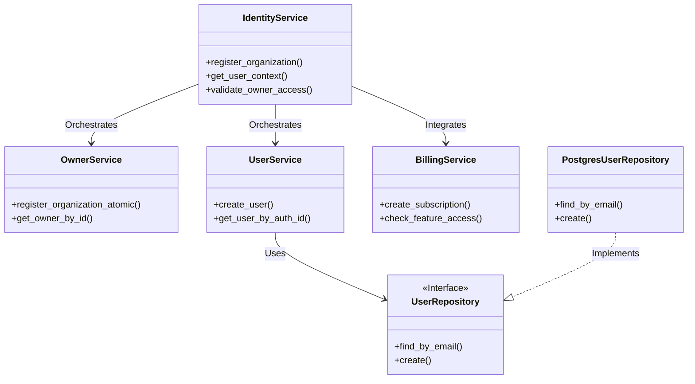

# Análise de Conformidade: Módulo Identity

**Data:** 06/02/2026
**Responsável:** AI Assistant
**Módulo:** `src/modules/identity/`
**Versão Analisada:** Current

---

## 1. Sumário Executivo

O módulo `identity` apresenta um alto nível de maturidade arquitetural, aderindo estritamente aos princípios de **Clean Architecture** e **Domain-Driven Design (DDD)**. A separação entre camadas (API, Services, Repositories, Models) é clara e bem executada, promovendo testabilidade e manutenção.

A segurança é tratada de forma robusta, delegando a autenticação para provedores externos e focando na gestão de identidade e autorização interna via RBAC. A integração com o módulo de `Billing` demonstra um design modular eficaz (Loose Coupling).

Entretanto, o módulo apresenta uma **dívida técnica crítica**: a implementação é predominantemente **síncrona**. Em um ambiente FastAPI projetado para alta concorrência, operações de I/O bloqueantes (banco de dados) podem degradar severamente a performance sob carga. Além disso, o tratamento de erros precisa de refinamento para evitar retornos HTTP 500 em violações de regras de negócio.

**Nota Geral:** 8.5/10 (Conforme, com ressalvas de performance)

---

## 2. Mapa de Responsabilidades

### Arquitetura de Componentes

---

## 3. Avaliação Detalhada

### ✅ Conformidade Arquitetural
*   **Status:** Conforme
*   **Justificativa:** O módulo segue rigorosamente a separação de camadas. Entidades de domínio (`models/`) são desacopladas da persistência. DTOs (`dtos/`) isolam a API do modelo interno. A Injeção de Dependência (`dependency_injector`) é utilizada consistentemente nos Controladores e Serviços.

### 🔒 Segurança
*   **Status:** Conforme
*   **Justificativa:**
    *   **Auth:** Delegação para provedor externo (Token JWT validado no Core).
    *   **RBAC:** Verificações explícitas de Role (ex: `current_user.role != UserRole.ADMIN`) nos endpoints.
    *   **Dados:** Uso de Pydantic para sanitização de entrada. Validação de ULIDs previne injeção de IDs inválidos.
    *   **PII:** *Atenção:* Logs registram nomes de organização, mas devem ser auditados para garantir que `email` ou `phone` não vazem em texto plano (revisar `IdentityService.register_organization`).

### 💎 Qualidade de Código
*   **Status:** Conforme
*   **Justificativa:**
    *   Código totalmente tipado com `typing` e Pydantic.
    *   Docstrings presentes em classes e métodos públicos.
    *   Funções com responsabilidade única e baixa complexidade ciclomática.
    *   Padrão PEP 8 respeitado.

### 🚀 Performance
*   **Status:** ⚠️ Parcial
*   **Justificativa:** A implementação é **Síncrona** (`def` em vez de `async def`). Embora o FastAPI execute essas funções em *threadpools*, isso não escala tão bem quanto I/O assíncrono nativo para operações de banco de dados, tornando-se um gargalo potencial.

### 📡 Observabilidade
*   **Status:** Conforme
*   **Justificativa:** Logging estruturado presente nos fluxos críticos (registro, erros de validação). IDs de correlação (OwnerID/UserID) são logados para rastreabilidade.

### 🧪 Testes
*   **Status:** Conforme
*   **Justificativa:** Testes unitários (`tests/modules/identity/services/test_identity_service.py`) utilizam `unittest.mock` para isolar dependências externas, garantindo execução rápida e foco na regra de negócio.

---

## 4. Matriz de Priorização

| Risco/Impacto | Esforço Baixo | Esforço Alto |
| :--- | :--- | :--- |
| **Crítico** | **Tratamento de Exceções**   (Mapear `ValueError` -> 400/409) | **Migração Async**   (Converter Repos e Services) |
| **Alto** | **Sanitização de Logs**   (Revisar PII em logs de erro) | |
| **Médio** | **Testes de Contrato**   (Validar Schema DB vs Pydantic) | |

---

## 5. Plano de Ação

1.  **Migração para Async (Prioridade 1):**
    *   Refatorar `IUserRepository` e implementações para métodos `async def`.
    *   Atualizar `IdentityService`, `UserService` e `OwnerService` para `async def` e usar `await`.
    *   Atualizar Controladores (`api/v1/`) para `async def`.

2.  **Refinamento de Tratamento de Erros (Prioridade 2):**
    *   Criar exceções de domínio (ex: `UserAlreadyExistsError`).
    *   Implementar `ExceptionHandler` no FastAPI para capturar essas exceções e retornar códigos HTTP 409 (Conflict) ou 400 (Bad Request) em vez de 500.

3.  **Auditoria de Logs (Prioridade 3):**
    *   Verificar logs em `register_organization` para garantir que dados sensíveis (email, telefone) passem pelo `PIIMaskingProcessor` ou não sejam logados em caso de falha.

---

## 6. Perguntas de Arquitetura

1.  *Existe um plano para migrar o driver de banco de dados para uma versão totalmente assíncrona (ex: `asyncpg` ou cliente Supabase Async)?*
2.  *A validação de "Feature Access" (integração com Billing) deve manter cache local no `IdentityService` para evitar latência em cada requisição?*
3.  *Como garantimos a consistência eventual se o `register_organization_atomic` falhar na etapa de criação de assinatura (Billing)? O mecanismo de compensação/rollback está documentado?*
