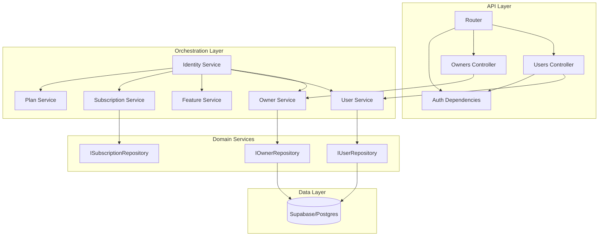

# Análise de Conformidade - Módulo Identity

**Data:** 05/02/2026
**Responsável:** Trae AI
**Módulo:** `src/modules/identity`
**Versão:** 1.0.0

---

## 1. Sumário Executivo

O módulo de **Identity** é o núcleo de gestão de usuários, proprietários (owners), planos e permissões do sistema. Com aproximadamente **3.173 linhas de código**, é um módulo de **Alta Criticidade**, pois governa o acesso a todos os outros recursos.

A arquitetura segue rigorosamente os princípios de **Clean Architecture** e **DDD**, com separação clara entre API, DTOs, Serviços e Repositórios. O uso de **ULID** para identificadores e **Pydantic** para validação é consistente e robusto.

**Principais Descobertas:**
*   **Fortaleza:** Estrutura de código madura, uso de Injeção de Dependência (`dependency-injector`) e validação forte de dados.
*   **Risco Crítico (Segurança):** O endpoint `POST /users/` (criação de usuário) **não possui verificação de autenticação ou autorização**. Atualmente, qualquer cliente que conheça um `owner_id` válido pode criar novos usuários na organização sem credenciais.
*   **Performance:** Assim como no módulo de Billing, os repositórios utilizam o cliente Supabase de forma síncrona dentro de rotas assíncronas do FastAPI, o que pode causar bloqueio do Event Loop sob carga.
*   **Qualidade:** A cobertura de testes existe (`tests/modules/identity`), mas foca muito em testes de API com mocks de serviço. A lógica complexa de orquestração em `IdentityService` (ex: `register_organization` com rollback manual) requer testes de unidade mais rigorosos para garantir atomicidade em cenários de falha.

A nota geral é **7.0 (Parcial)**, sustentada pela excelente arquitetura, mas penalizada pela falha de segurança pontual e grave.

---

## 2. Mapa de Responsabilidades

---

## 3. Avaliação por Categorias

### ✅ Conformidade

| Categoria | Status | Justificativa |
| :--- | :--- | :--- |
| **Arquitetura** | ✅ Conforme | Clean Architecture exemplar. Interfaces definidas, DTOs para transporte, separação de camadas clara. |
| **Segurança** | 🔴 Não Conforme | **Falha Crítica:** Endpoint `POST /users/` aberto publicamente. Falta de validação se quem cria o usuário tem permissão de Admin no Owner. |
| **Qualidade** | ✅ Conforme | Código limpo, bem tipado, uso de ULIDs, tratamento de erros com logs. Rollback manual em `register_organization` é um bom esforço de consistência. |
| **Performance** | ⚠️ Parcial | Uso de I/O síncrono (Supabase client) em endpoints Async. Pode escalar mal. |
| **Documentação** | ✅ Conforme | Docstrings detalhadas, README (implícito na estrutura), código auto-explicativo. |
| **Observabilidade**| ✅ Conforme | Logs estruturados (`logger.info`, `logger.error`) em pontos chave dos serviços. |

### 💪 Pontos Fortes

1.  **Orquestração Robusta:** A classe `IdentityService` centraliza fluxos complexos (como registro de organização) que tocam múltiplas entidades, mantendo os serviços de domínio (`UserService`, `OwnerService`) focados em responsabilidade única.
2.  **Validação de Dados:** Uso extensivo de Pydantic com validadores customizados para ULID e enums, garantindo integridade dos dados antes de chegar ao banco.
3.  **Abstração de Repositório:** A implementação base `SupabaseRepository` com validação de ULID embutida (`validates_ulid=True`) reduz duplicação de código.

### ⚠️ Pontos Fracos

1.  **Consistência de Dados (Rollback Manual):** O método `register_organization` tenta fazer rollback manual em caso de erro (`try/except -> delete`). Isso é frágil. Se o servidor cair no meio do processo, o banco fica inconsistente (Owner sem User). Falta uso de transações de banco (Atomicidade real).
2.  **I/O Bloqueante:** Chamadas síncronas ao banco dentro de rotas `async def` anulam os benefícios de concorrência do FastAPI.
3.  **Dependência Cíclica Potencial:** `IdentityService` depende de quase todos os outros serviços. Cuidado com o acoplamento.

### 🔴 Riscos

1.  **CRÍTICO - Criação de Usuário Não Autenticada:** O endpoint `create_user` em `src/modules/identity/api/v1/users.py` não tem `Depends(get_authenticated_owner_id)` ou similar. Permite injeção de usuários.
2.  **MÉDIO - Inconsistência de Dados:** Falhas durante o registro de organização podem deixar "sujeira" no banco (Owners órfãos) devido à falta de transações ACID.

### 🎯 Oportunidades

*   **Quick Win:** Adicionar `Depends(get_authenticated_owner_id)` (ou check de role Admin) no endpoint `create_user`.
*   **Estrutural:** Implementar "Unit of Work" ou Transações do Supabase (via RPC ou cliente Postgres direto) para garantir que `register_organization` seja atômico.
*   **Refatoração:** Migrar para cliente assíncrono do Supabase (`supabase-py-async` ou usar `motor`/`databases` se mudar o backend).

### 📊 Nota: 7.0 / 10

---

## 4. Diagramas

### Fluxo de Registro de Organização (Atual vs Ideal)

**Atual (Rollback Manual):**
1. Cria Owner
2. Tenta Criar User
   - Erro? -> Deleta Owner (Risco: Falha de rede aqui deixa Owner órfão)
3. Cria Subscription

**Ideal (Transacional):**
1. Abre Transação
2. Cria Owner
3. Cria User
4. Cria Subscription
5. Commit (ou Rollback automático do DB em erro)

---

## 5. Matriz de Priorização

| Risco/Impacto | Esforço | Ação Prioritária | Item |
| :--- | :--- | :--- | :--- |
| **Crítico** | **Baixo** | **Imediato** | Proteger rota `POST /users/` com autenticação e validação de Role Admin. |
| **Médio** | **Alto** | **Médio Prazo** | Implementar transações reais (ACID) para fluxos de orquestração. |
| **Médio** | **Médio** | **Médio Prazo** | Migrar Repositórios para Async IO. |

---

## 6. Plano de Ação (Top 5)

1.  **Segurança:** Adicionar dependência de segurança (`get_current_user_id` + verificação de Role ADMIN) no endpoint `create_user` em `api/v1/users.py`.
2.  **Segurança:** Revisar todos os endpoints de escrita (`POST`, `PUT`, `DELETE`) em `api/v1/` para garantir que exigem autenticação adequada.
3.  **Arquitetura:** Refatorar `IdentityService.register_organization` para usar uma abordagem mais segura de transação (se possível com a stack atual) ou melhorar o mecanismo de compensação (ex: fila de limpeza de órfãos).
4.  **Testes:** Criar teste de integração que simule falha na criação do usuário durante o registro da organização para validar se o rollback manual está funcionando como esperado.
5.  **Performance:** Avaliar impacto do I/O síncrono. Se a latência for alta, priorizar migração para drivers async.

---

## 7. Perguntas de Arquitetura

1.  **Transações Distribuídas:** Como o sistema lida com falhas quando cria o usuário no Supabase Auth (externo) vs Banco de Dados interno? Existe reconciliação?
2.  **Roles:** A role `ADMIN` é por Organização ou do Sistema? O modelo atual sugere por usuário dentro de um Owner, o que está correto para SaaS B2B.
3.  **Sync de Usuários:** O endpoint `/sync` confia cegamente no `auth_id` enviado? Deveria validar o token JWT para garantir que o `auth_id` pertence a quem está chamando.

---

**Nota Final:** 7.0 (Sólido, mas com brecha de segurança pontual)
